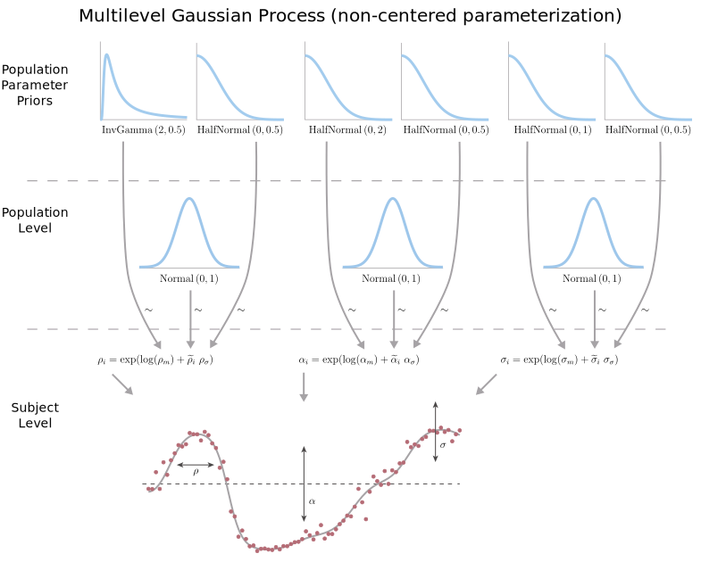
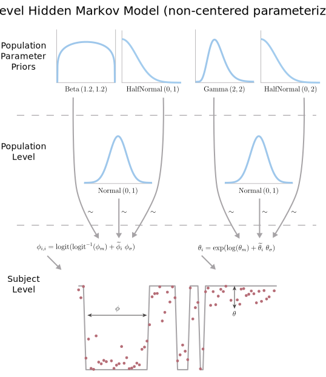

In the previous notebook, we build Gaussian process and hidden Markov models for a single time series.  However, we'll want models which can handle both multiple trials (multiple time series) and data from multiple subjects (and allow for random effects).  Therefore, in this notebook we'll build multilevel versions of the Gaussian process and hidden Markov models, and verify that they work.

## Setup 

Let's set up our computing environment:

```{r}
setwd("~/Code/hmm-vs-gp")

# Packages
library(rstan)
library(ggplot2)
library(bayesplot)
library(invgamma)
library(bridgesampling)
library(RColorBrewer)
rstan_options(auto_write = TRUE)
options(mc.cores = parallel::detectCores())
seed = 1234567

# Colors
c_light <- c("#DCBCBC")
c_mid <- c("#B97C7C")
c_dark <- c("#8F2727")
c_blue_light <- c("#b2c4df")
c_blue_mid <- c("#6689bf")
c_blue_dark <- c("#3d5272")
color_scheme_set("red")
```


## Repeated Measures

The Stan models we've created so far are only able to handle a single time series.  But we have multiple time series: one for each pass through the choice point.  That is, one per trial.  To handle multiple trials, we have to create modified Stan models which accumulate the contribution of each trial by summing the log likelihoods of each trial.  Here's Stan code for a Gaussian process which can handle multiple trials:

```{r}
writeLines(readLines("lgp_multitrial.stan"))
```

And Stan code for a hidden Markov model which can handle multiple trials:

```{r}
writeLines(readLines("hmm_multitrial.stan"))
```

These are relatively minor changes to the Stan routines - basically we've simply accumulated the log posterior across trials.  The rest of this section is simply validating that these Stan models work correctly.

Let's generate some data from a Gaussian process which contiains multiple time series (as if we collected data over multiple trials).

```{r}
# Data
N = 100
Nt = 10 #number of trials
x = seq(0, 5, l=N)

# Parameters
rho = 0.5
alpha = 2
sigma = 0.3

# Arrays to store generated data
f = matrix(data=NA, nrow=Nt, ncol=N)
y = matrix(data=NA, nrow=Nt, ncol=N)
xs = matrix(x, nrow=Nt, ncol=N, byrow=TRUE)

# Simulate
sim_params = list(N=N, x=x, rho=rho, alpha=alpha, sigma=sigma)
for (trial in 1:Nt){
  sim_gp = stan(file='simulate_lgp.stan', data=sim_params, iter=1, 
                chains=1, seed=trial*100, algorithm="Fixed_param")
  f[trial,] = extract(sim_gp)$f
  y[trial,] = extract(sim_gp)$y
}

# Store data
gp_data = list(N=N, Nt=Nt, x=x, y=y)
```

And now we can take a look at all the latent functions we generated (lines) and the corresponding observations (points).

```{r, dev='svg'}
# Set the palette to something as ungarish as possible...
palette(brewer.pal(n=10, name="Paired"))

# Plot the data
matplot(t(xs), t(f), type='l', lty=1, lwd=2, 
        ylim=c(0, 1), xlab='', ylab='')
par(new=T)
matplot(t(xs), t(y), type='p', pch=20, 
        ylim=c(0, 1), xlab='x', ylab='f')
title('Multiple draws from a Gaussian process')
```

Similarly, we'll generate multiple time series from a hidden Markov model.

```{r}
# Data
N = 100
Nt = 10 #number of trials

# Parameters
phi = array(c(0.9, 0.1, 0.1, 0.9), dim=c(2,2)) #transition probabilities
theta = c(5, 5) #observation distribution parameters

# Arrays to store generated data
s = matrix(data=NA, nrow=Nt, ncol=N)
y = matrix(data=NA, nrow=Nt, ncol=N)
xs = matrix(x, nrow=Nt, ncol=N, byrow=TRUE)

# Simulate
sim_params = list(N=N, phi=phi, theta=theta)
for (trial in 1:Nt){
  sim_hmm = stan(file='simulate_hmm.stan', data=sim_params, iter=1, 
                 chains=1, seed=trial*100, algorithm="Fixed_param")
  s[trial,] = extract(sim_hmm)$s-1
  y[trial,] = extract(sim_hmm)$y
}

# Store data
hmm_data = list(N=N, Nt=Nt, x=x, y=y)
```

And here's the data generated by the hidden Markov model.  (Note that the y values below aren't accurate, the traces are staggered so we can see each trace)

```{r, dev='svg'}
# Plot the data
matplot(t(xs), t(s+0:9), type='l', lty=1, lwd=2, 
        ylim=c(0, 10), xlab='', ylab='')
par(new=T)
matplot(t(xs), t(y+0:9), type='p', pch=20, 
        ylim=c(0, 10), xlab='x', ylab='f')
title('Multiple draws from a hidden Markov model')
```

Now we can fit both models to both sets of data.

```{r}
# Fit each model to each multitrial dataset
fit_gp_to_gp = stan(file='lgp_multitrial.stan', data=gp_data, seed=seed)
fit_hmm_to_gp = stan(file='hmm_multitrial.stan', data=gp_data, seed=seed)
fit_gp_to_hmm = stan(file='lgp_multitrial.stan', data=hmm_data, seed=seed)
fit_hmm_to_hmm = stan(file='hmm_multitrial.stan', data=hmm_data, seed=seed)
```

Let's check the MCMC diagnostics to ensure there weren't any major problems with the fits.

```{r}
# Check MCMC diagnostics for GP fit to GP data
check_hmc_diagnostics(fit_gp_to_gp)

# Check MCMC diagnostics for HMM fit to GP data
check_hmc_diagnostics(fit_hmm_to_gp)

# Check MCMC diagnostics for GP fit to HMM data
check_hmc_diagnostics(fit_gp_to_hmm)

# Check MCMC diagnostics for HMM fit to HMM data
check_hmc_diagnostics(fit_hmm_to_hmm)
```

The chains converged for all four fits (Rhat values look good - i.e. they are near 1).

```{r}
# Check GP fit to GP data
print(fit_gp_to_gp)

# Check HMM fit to GP data
print(fit_hmm_to_gp)

# Check GP fit to HMM data
print(fit_gp_to_hmm)

# Check HMM fit to HMM data
print(fit_hmm_to_hmm)
```

Were the models able to recover the parameters used to generate the data?  First let's make a function to plot the posterior distributions against the true value.

```{r}
# Function to plot posterior distributions w/ 95% confidence intervals
interval_density = function(x, bot=0.025, top=0.975,
                            main="", xlab="", ylab="",
                            xlim=c(min(x),max(x)), lwd=1,
                            col1=c("#DCBCBC"), col2=c("#B97C7C"),
                            true=NA, true_col=c("#8F2727")) {
  dens = density(x[x>xlim[1] & x<xlim[2]])
  plot(dens, main=main, xlab=xlab, ylab=ylab, xlim=xlim,
       lwd=lwd, yaxt='n', bty='n', type='n')
  polygon(dens, col=col1, border=NA)
  qbot <- quantile(x, bot)
  qtop <- quantile(x, top)
  x1 = min(which(dens$x >= qbot))
  x2 = max(which(dens$x < qtop))
  with(dens, polygon(x=x[c(x1,x1:x2,x2)], y=c(0, y[x1:x2], 0), col=col2, border=NA))
  if (!is.na(true)) {
    abline(v=true, col=true_col, lwd=3)
  }
}
```

The Gaussian process fit was able to sucessfully recover the parameters of the Gaussian process used to generate the data.  The vertical red line shows the true parameter value, and the distribution is the posterior.

```{r, dev='svg', fig.height=3, fig.width=8}
# Plot true vs posterior for GP
posterior = extract(fit_gp_to_gp)
par(mfrow=c(1, 3))
interval_density(posterior$rho, xlab="rho", true=rho)
interval_density(posterior$alpha, xlab="alpha", true=alpha)
interval_density(posterior$sigma, xlab="sigma", true=sigma)
```

Similarly, the hidden Markov model fit was able to sucessfully recover the parameters of the hidden Markov model used to generate the data.

```{r, dev='svg'}
# Plot true vs posterior
posterior = extract(fit_hmm_to_hmm)
par(mfrow=c(2, 2))
interval_density(posterior$phi[,1,1], xlab="phi[,1,1]",
                 true=phi[1,1])
interval_density(posterior$phi[,2,2], xlab="phi[,2,2]",
                 true=phi[2,2])
interval_density(posterior$theta[,1], xlab="theta[1]",
                 true=theta[1])
interval_density(posterior$theta[,2], xlab="theta[2]",
                 true=theta[2])
```

Do the fits of one model to data generated by the other model at least look reasonable?  The Gaussian process fit to the data generated by the hidden Markov model looks reasonable.

```{r, dev='svg', fig.height=3, fig.width=8}
# Plot true vs posterior
posterior = extract(fit_gp_to_hmm)
par(mfrow=c(1, 3))
interval_density(posterior$rho, xlab="rho", xlim=c(0, 0.4))
interval_density(posterior$alpha, xlab="alpha")
interval_density(posterior$sigma, xlab="sigma")
```

As does the hidden Markov model fit to the data generated by the Gaussian process.

```{r, dev='svg'}
# Plot true vs posterior
posterior = extract(fit_hmm_to_gp)
par(mfrow=c(2, 2))
interval_density(posterior$phi[,1,1], xlab="phi[,1,1]")
interval_density(posterior$phi[,2,2], xlab="phi[,2,2]")
interval_density(posterior$theta[,1], xlab="theta[1]")
interval_density(posterior$theta[,2], xlab="theta[2]")
```

The Bayes factor should favor a fit of the model which generated the data over a fit of the other model.  Let's use bridge sampling to estimate the marginal probabilities of each of the four fits so that we can estimate the Bayes factors.

```{r}
# Perform bridge sampling for each model
bridge_gp_gp = bridge_sampler(fit_gp_to_gp)
bridge_hmm_gp = bridge_sampler(fit_hmm_to_gp)
bridge_gp_hmm = bridge_sampler(fit_gp_to_hmm)
bridge_hmm_hmm = bridge_sampler(fit_hmm_to_hmm)
```

The bridge-sampling-estimated Bayes factor favored the Gaussian process fit to data generated by the Gaussian process.

```{r}
lbf1 = bf(bridge_gp_gp, bridge_hmm_gp, log=TRUE)
cat(sprintf("Log Bayes factor in favor of GP over HMM on GP-generated data: %0.3g\n", lbf1$bf))
```

Conversely, the bridge-sampling-estimated Bayes factor favored the hidden Markov model fit to data generated by the hidden Markov model.

```{r}
lbf2 = bf(bridge_hmm_hmm, bridge_gp_hmm, log=TRUE)
cat(sprintf("Log Bayes factor in favor of HMM over GP on HMM-generated data: %0.3g\n", lbf2$bf))
```

Finally, the log marginal likelihood of the Gaussian process was greater when fit to data generated by a Gaussian process than when fit to data generated by a hidden Markov model.

```{r}
cat(sprintf("Log marginal likelihood of GP fit to GP-generated data: %0.3g\n", bridge_gp_gp$logml))
cat(sprintf("Log marginal likelihood of GP fit to HMM-generated data: %0.3g\n", bridge_gp_hmm$logml))
```

And the log marginal likelihood of the hidden Markov model was greater when fit to data generated by a HMM than when fit to data generated by a Gaussian process.

```{r}
cat(sprintf("Log marginal likelihood of HMM fit to HMM-generated data: %0.3g\n", bridge_hmm_hmm$logml))
cat(sprintf("Log marginal likelihood of HMM fit to GP-generated data: %0.3g\n", bridge_hmm_gp$logml))
```

TODO: Hm. Uh. Or not...


## Multilevel Models

Another problem with the Stan models so far is they only handle a single subject.  We want our models to include mixed effects (that is, account for inter-subject variability).  So, we'll build multilevel versions of both the Gaussian process and hidden Markov models which can handle multiple trials from multiple subjects.  This "multilevel" model will have a subject level and a population level.  At the subject level, each subject has their own set of parameters, which are used to compute the probability of the data for that subject.  But, each subect's parameters aren't completely independent: at the population level, each subject's paramters are drawn from a population distribution. 


### Gaussian Process

Our basic single-level Gaussian process has three parameters: the length scale ($\rho$), the signal standard deviation ($\alpha$, a.k.a. the marginal or output standard deviation), and the noise standard deviation ($\sigma$).  All three parameters are constrained to be greater than zero.  We'll use a [log-normal distribution](https://en.wikipedia.org/wiki/Log-normal_distribution) to model the population distribution for all three parameters.  A log normal distribution is just a normal distribution, but where the variable has been passed through the $\log$ function.  This causes the distribution to be defined only $>0$. Furthermore, we'll put a prior on the medians of these population-level distributions which is the same as the priors we were previously using on the parameters themselves (in the single-subject versions of the models).

Here's a diagram of the multilevel Gaussian process model, and below we'll walk through it step by step.


The length scale parameter ($\rho$) for each subject $i$ is drawn from a population log-normal distribution with median $\rho_m$ and standard deviation parameter $\rho_\sigma$.

$$
\forall i, ~ \rho_i \sim \text{LogNormal}(\log (\rho_m), ~ \rho_\sigma)
$$

I say "standard deviation parameter" instead of "standard deviation", because the second parameter of the log-normal distribution is not the standard deviation of the distribution - it's the standard deviation of the *logarithm* of the distribution.

The prior on the median of this population distribution is an inverse gamma distribution with $\alpha=2$ and $\beta=0.5$ (which was the prior on the $\rho$ parameter in the single-subject models).

$$
\rho_m \sim \text{InvGamma}(2, 0.5)
$$

The prior on the standard deviation parameter ($\rho_\sigma$) is a half-normal distribution with a standard deviation of $0.5$.

$$
\rho_\sigma \sim \text{HalfNormal}(0, 0.5)
$$

The signal standard deviation parameter ($\alpha$) for each subject $i$ is drawn from a population log-normal distribution with median $\alpha_m$ and standard deviation parameter $\alpha_\sigma$..

$$
\forall i, ~ \alpha_i \sim \text{LogNormal}(\log (\alpha_m), ~ \alpha_\sigma)
$$

The prior on the median of this population distribution is a half-normal distribution with $\mu=0$ and $\sigma=2$ (which was the prior on the $\alpha$ parameter in the single-subject models).

$$
\alpha_m \sim \text{HalfNormal}(0, 2)
$$

The prior on the standard deviation parameter ($\alpha_\sigma$) is also a half-normal distribution, but with a standard deviation of $0.5$.

$$
\alpha_\sigma \sim \text{HalfNormal}(0, 0.5)
$$

Finally, the noise standard deviation parameter ($\sigma$) for each subject $i$ is drawn from a population log-normal distribution with median $\sigma_m$ and standard deviation parameter $\sigma_sigma$.

$$
\forall i, ~ \sigma_i \sim \text{LogNormal}(\log (\sigma_m), \sigma_\sigma)
$$

The prior on the median of this population distribution is a half-normal distribution with a standard deviation of $1$ (which was the prior on the $\alpha$ parameter in the single-subject models).

$$
\sigma_m \sim \text{HalfNormal}(0, 1)
$$

And the prior on the standard deviation parameter ($\sigma_\sigma$) is a half-normal distribution with a standard deviation of $0.5$.


### Hidden Markov Model

The single-subject hidden Markov model has four parameters: the recurrent transition probabilities for state 1 ($\phi_{1,1}$) and state 2 ($\phi_{2,2}$), along with the observation parameters for state 1 ($\theta_1$) and state 2 ($\theta_2$).  The transition probabilities ($\phi_{i,i}$) are constrained between 0 and 1, so we'll use a [logit-normal distribution](https://en.wikipedia.org/wiki/Logit-normal_distribution) to model their population distribution, which keeps the density between 0 and 1.  This is similar to what we did in order to bound the Gaussian process between 0 and 1.  On the other hand, the observation parameters ($\theta_i$) are constrained to be greater than zero (with no upper bound), so we'll use a log-normal distribution to model their population distribution (as we did with the population distributions for the multilevel Gaussian process).  

Like with the multilevel Gaussian process, we'll put a prior on the medians of the population distributions which are identical to the priors we used on the raw parameters in the single-subject versions of the models.  Why the medians instead of the means?  Just for simplicity and consistency, really.  Because of the skew introduced by the log- and logit-transforms, the means of the log- and logit-normal distributions are not equal to their $\mu$ parameters.  The mean of a log-normal distribution is relatively easy to compute ($exp(\mu+\frac{\sigma^2}{2})), but the mean of a logit-normal distribution has no analytical solution, and would have to be estimated numerically.  Which would be a pain to do manually in Stan, would be *hideously* inelegant, and as of version 2.17.0, Stan doesn't have a built-in function for doing this.  So, I decided to just put the prior on the median (instead of the mean) for all population-level distributions.

Here's a diagram of the multilevel hidden Markov model, and below we'll walk through it step by step.


The transition probability parameters ($\phi_{i,i}$) for each subject $s$ are drawn from population logit-normal distributions with medians $\phi_{i,m}$ and standard deviation parameters $\phi_{i,\sigma}$.

$$
\forall s, ~ \phi_{i,i,s} \sim \text{LogitNormal}(\text{logit}^{-1}(\phi_{i,m}), ~ \phi_{i,\sigma})
$$

Where $\phi_{i,i,s}$ is the $\phi_{i,i}$ parameter for subject $s$ and state $i$, $\phi_{i,m}$ is the median of the population distribution for the recurrent transition probability parameters of state $i$, and $\phi_{i,\sigma}$ is the standard deviation parameter for that population distribution.

The prior on the medians of these population distributions are beta distributions with $\alpha=1.2$ and $\beta=1.2$ (which was the prior on the $\phi_{i,i}$ parameters in the single-subject models).

$$
\forall i \in \{1,2\}, ~ \phi_{i,m} \sim \text{Beta}(1.2, 1.2)
$$

And the prior on the standard deviation parameters are half-normal distributions with standard deviations of 1.

$$
\forall i \in \{1,2\}, ~ \phi_{i,\sigma} \sim \text{HalfNormal}(0, 1)
$$

The observation parameters ($\theta_i$) for each subject $s$ are drawn from population log-normal distributions with medians $\theta_{i,m}$ and standard deviation parameters $\theta_{i,\sigma}$.  

$$
\forall s, ~ \theta_{i,s} \sim \text{LogNormal}(\log(\theta_{i,m}), ~ \theta_{i,\sigma})
$$

Where $\theta_{i,s}$ is the $\theta_i$ parameter for subject $s$ and state $i$, $\theta_{i,m}$ is the median of the population distribution for the observation distribution parameter for state $i$, and $\theta_{i,\sigma}$ is the standard deviation parameter for that population distribution.

The prior on the medians of these population distributions are gamma distributions with $\alpha=2$ and $\beta=2$ (which was the prior on the $\theta_i$ parameters in the single-subject models).

$$
\forall i \in \{1, 2\}, ~ \theta_{i,m} \sim \text{Gamma}(2,2)
$$

And the prior on the standard deviation parameters are half-normal distributions with standard deviations of 2.

$$
\forall i \in \{1, 2\}, ~ \theta_{i,\sigma} \sim \text{HalfNormal}(0,2)
$$


### Non-centered parameterizations

In theory, the models above are good as is.  However, in practice, the models are difficult to sample from because of the geometry of the posterior distribution.  With a hierarchical model, individuals' parameters are drawn from a population distribution.  When the variance of the population distribution is large, the individuals' parameters are able to approach their non-pooled values (the value which that individual's parameter would have if we fit the model to only data from that individual).  However, the variance of the population distribution can shrink (up to a point) while maintaining a similar posterior probability, because while the likelihood of any one individual's data decreases, the likelihood due to individuals' parameters being drawn from the population distribution increases (because the distribution is being compressed).  This can lead to a "funnel"-like geometry in the posterior.


Stan and other MCMC-based samplers use a sampling method which takes discrete steps (check out this [great interactive animation by Chi Feng](https://chi-feng.github.io/mcmc-demo/app.html#EfficientNUTS,banana) showing how different MCMC samplers sample from the posterior).  So, at the "neck" of the "funnel," the posterior is extremely thin, and the sampler can quickly step out of a region of high posterior density.  When it does so, the large gradient outside the funnel can cause the sampling transitions to "diverge" (shoot out towards infinity).  Most of the transitions in the neck of the funnel will end in this kind of divergence when the funnel is sharp enough, and so the resulting MCMC samples won't accurately reflect the true posterior because they didn't sample in the neck of the funnel!  This will cause our parameter estimates to be incorrect, as they will be biased away from the region of parameter-space corresponding to the neck of the funnel.  If we try to fit the models as is, nearly *half* of the transitions end up diverging!

To correct for this problem, we can use a non-centered parameterization of our models.  Instead of defining an individual $i$'s parameter (say, $\theta_i$) as being drawn from a population distribution, we will instead draw a per-subject scaling factor $\tilde{\theta}_i$ from a normal distribution (which is independent from the population distribution variance).

$$
\tilde{\theta}_i \sim \text{Normal}(0, 1)
$$

Then we can set each individual's parameter by multiplying the population distribution standard deviation ($\theta_\sigma$) by the scaling factor, and adding the population distribution's location parameter ($\theta_m$).

$$
\theta_i = \theta_m + \tilde{\theta}_i ~ \theta_\sigma
$$

This is mathematically equivalent to our previous model, but transforms the posterior distribution's geometry into a much simpler form.  Now, parameter-space only includes the value for $\tilde{\theta}$ and not for $\theta$ itself, which is now a transformed parameter.  This means the posterior is no longer funnel-shaped, and divergent transitions become much less of a problem.  For more about this problem and how to fix it, check out this great [case study by Michael Betancourt](http://mc-stan.org/users/documentation/case-studies/divergences_and_bias.html).  Or [read the paper about it](https://arxiv.org/abs/1312.0906).

Here's a diagram of the non-centered parameterization of the Gaussian process model.  Instead of drawing individuals' parameters from a population distribution, we now construct them from per-subject scaling factors which are drawn from a standard normal distribution.



Here is the Stan routine for the multilevel Gaussian process model, with a non-centered parameterization.  The main difference is that now we have to compute a covariance matrix for each subject individually, and now we have population distributions from which individual subject's parameters are drawn.

```{r}
writeLines(readLines("lgp_multilevel.stan"))
```

I tried implementing several optimizations, including pre-computing logit(y) (in the transformed data block), writing a custom user-defined Stan function to compute the covariance matrix which assumed linearly-spaced x values, etc.  However, none of the optimizations actually ended up making the sampling run any faster!  Stan's pretty fast as is.  Well.  Maybe not "fast".  *Optimized*.

We'll do the same thing for the hidden Markov model.  Here's a diagram of the non-centered parameterization of the hidden Markov model.



And here's the Stan routine for the multilevel hidden Markov model with a non-centered parameterization.

```{r}
writeLines(readLines("hmm_multilevel.stan"))
```


### Validation

Let's generate some data from a Gaussian process which contiains simulated data from multiple trials and multiple subjects.

```{r}
# Data
N = 50 #datapoints per trial
Ns = 5 #number of subjects
Nts = 5 #number of trials per subject
Nt = Ns*Nts #total number of trials
x = seq(0, 2.5, l=N)

# Population Distribution Means and variances
rho_mu = 0.5
rho_var = 0.025
alpha_mu = 2
alpha_var = 0.1
sigma_mu = 0.3
sigma_var = 0.01

# Compute gamma distribution parameters from mean + variance
rho_a = rho_mu*rho_mu/rho_var
rho_b = rho_mu/rho_var
alpha_a = alpha_mu*alpha_mu/alpha_var
alpha_b = alpha_mu/alpha_var
sigma_a = sigma_mu*sigma_mu/sigma_var
sigma_b = sigma_mu/sigma_var

# Arrays to store generated data
f = matrix(data=NA, nrow=Nt, ncol=N) #latent function
y = matrix(data=NA, nrow=Nt, ncol=N) #observation values
sid = matrix(data=NA, Nt)        #subject id
rho_true = matrix(data=NA, Ns)   #true rho value for each subject
alpha_true = matrix(data=NA, Ns) #true alpha value for each subject
sigma_true = matrix(data=NA, Ns) #true sigma value for each subject
xs = matrix(x, nrow=Nts, ncol=N, byrow=TRUE)

# Simulate
for (sub in 1:Ns){
  rho_true[sub] = rgamma(1, rho_a, rho_b) #rho for this subject
  alpha_true[sub] = rgamma(1, alpha_a, alpha_b) #alpha for this subj
  sigma_true[sub] = rgamma(1, sigma_a, sigma_b) #sigma for this subj
  sim_params = list(N=N, x=x, rho=rho_true[sub], 
                    alpha=alpha_true[sub], sigma=sigma_true[sub])
  for (trial in 1:Nts){
    ix = (sub-1)*Nts+trial #index in array of all trials
    sim_gp = stan(file='simulate_lgp.stan', data=sim_params, iter=1, 
                  chains=1, seed=ix, algorithm="Fixed_param")
    f[ix,] = extract(sim_gp)$f
    y[ix,] = extract(sim_gp)$y
    sid[ix,] = sub
  }
}

# Store data
gp_data = list(N=N, Nt=Nt, Ns=Ns, x=x, S=as.vector(sid), y=y)
```

And now we can take a look at all the latent functions we generated (lines) and the corresponding observations (points) for each subject (stacked vertically).

```{r, dev='svg'}
# Plot the data
plot.new()
par(mfrow=c(Ns,1))
for (sub in 1:Ns){
  ix = 1:Nts+(sub-1)*Nts #indexes of this subj in array of all trials
  par(mfg=c(sub,1), mar=c(1,4,1,1))
  matplot(t(xs), t(f[ix,]), type='l', lty=1, lwd=2, 
          ylim=c(0, 1), xlab='', ylab='')
  par(new=T)
  matplot(t(xs), t(y[ix,]), type='p', pch=20, 
          ylim=c(0, 1), xlab='x', ylab=paste('Sub ',toString(sub)))
}
```

Similarly, we'll generate multiple trials from multiple subjects using a hidden Markov model.

```{r}
# Population Distribution Means and variances
phi_mu = 0.9
phi_var = 0.043
theta_mu = 4
theta_var = 0.3

# Compute distribution parameters from mean + variance
phi_a = 18
phi_b = 2
theta_a = (theta_mu-1)*(theta_mu-1)/theta_var
theta_b = (theta_mu-1)/theta_var

# Arrays to store generated data
s = matrix(data=NA, nrow=Nt, ncol=N) #hidden state
y = matrix(data=NA, nrow=Nt, ncol=N) #observed values
sid = matrix(data=NA, Nt)          #subject id
phi_true = matrix(data=NA, Ns, 2)  #true phi values for each subject
theta_true = matrix(data=NA, Ns, 2)#true theta values for each subject

# Simulate
for (sub in 1:Ns){
  p1 = rbeta(1, phi_a, phi_b) #phi parameters for this subject
  p2 = rbeta(1, phi_a, phi_b)
  t1 = 1+rgamma(1, theta_a, theta_b) #thetas for this subj
  t2 = 1+rgamma(1, theta_a, theta_b)
  phi_true[sub,] = c(p1,p2)
  theta_true[sub,] = c(t1,t2)
  phi = t(array(c(p1, 1-p1, 1-p2, p2), dim=c(2,2)))
  theta = c(t1, t2)
  sim_params = list(N=N, phi=phi, theta=theta)
  for (trial in 1:Nts){
    ix = (sub-1)*Nts+trial #index in array of all trials
    sim_hmm = stan(file='simulate_hmm.stan', data=sim_params, iter=1, 
                   chains=1, seed=ix, algorithm="Fixed_param")
    s[ix,] = extract(sim_hmm)$s-1
    y[ix,] = extract(sim_hmm)$y
    sid[ix,] = sub
  }
}

# Store data
hmm_data = list(N=N, Nt=Nt, Ns=Ns, x=x, S=as.vector(sid), y=y)
```

And here's the data generated by the hidden Markov model.

```{r, dev='svg'}
# Plot the data
plot.new()
par(mfrow=c(Ns,1))
for (sub in 1:Ns){
  ix = 1:Nts+(sub-1)*Nts #indexes of this subj in array of all trials
  par(mfg=c(sub,1), mar=c(1,4,1,1))
  matplot(t(xs), t(s[ix,]), type='l', lty=1, lwd=2, 
          ylim=c(0, 1), xlab='', ylab='')
  par(new=T)
  matplot(t(xs), t(y[ix,]), type='p', pch=20, 
          ylim=c(0, 1), xlab='x', ylab=paste('Sub ',toString(sub)))
}
```

Now we can fit both models to both sets of data.

```{r}
# Fit each model to each multisubject dataset
fit_gp_to_gp = stan(file='lgp_multilevel.stan', data=gp_data, seed=seed)
fit_hmm_to_gp = stan(file='hmm_multilevel.stan', data=gp_data, seed=seed)
fit_gp_to_hmm = stan(file='lgp_multilevel.stan', data=hmm_data, seed=seed)
fit_hmm_to_hmm = stan(file='hmm_multilevel.stan', data=hmm_data, seed=seed)
```

The chains converged for all four fits (Rhat values look good are near 1), and the number of effective samples look OK for the parameters of interest, though we may want to run sampling for more iterations than the default (notice that the effective number of samples for the population mean parameters `phi_m` and `theta_m` are closer to 1000 than 4000).  Let's take a look at the HMC diagnostics.

```{r}
# Check MCMC diagnostics for GP fit to GP data
check_hmc_diagnostics(fit_gp_to_gp)

# Check MCMC diagnostics for HMM fit to GP data
check_hmc_diagnostics(fit_hmm_to_gp)

# Check MCMC diagnostics for GP fit to HMM data
check_hmc_diagnostics(fit_gp_to_hmm)

# Check MCMC diagnostics for HMM fit to HMM data
check_hmc_diagnostics(fit_hmm_to_hmm)
```

The diagnostics look mostly good, however there were a few divergent transitions.  However, an extremely small proportion of all the MCMC transitions were divergent (less than half a percent of samples).  Let's take a look at the fit with the most divergent transitions (the fit of the hidden Markov model to the data generated by itself). Below we've plotted the value of the standard deviation of the $\phi_{1,1}$ population distribution (on the y-axis) and the value of the first subject's $\phi_{1,1}$ parameter (on the x-axis). If divergent transitions were being caused by a misspecification of our hierarchical model, we would expect to see the divergent transitions concentrated at the "tip" of the hierarchical "funnel". Each dot is a MCMC sample, and bright red dots indicate samples which ended in a divergence.  

```{r, dev='svg'}
# Show pairs plot for phi param
mcmc_scatter(as.array(fit_hmm_to_hmm), 
             pars=c("phi[1,1,1]", "phi_s[1]"), 
             transform=list("phi_s[1]"="log"), 
             np=nuts_params(fit_hmm_to_hmm))
```

The divergent transitions don't seem to be concentrating in any particular region of parameter space, and so increasing our `adapt_delta` parameter will probably help decrease the number of divergent transitions, and we don't need to re-specify our model.  If we had fit the original version of the model (the centered parameterization), divergent transitions would have been concentrated at the tip of the funnel, and nearly half of the transitions would have ended in a divergence!

To be absolutely sure, we can check this for each subject.  In the pairs plots below, the hierarchical funnel can be seen in the bottom row, where the funnel shrinks going downward, and in the rightmost column, where the funnel shrinks going leftward.  Here, red x's mark divergent transitions.

```{r, dev='svg'}
# Show pairs plot for phi param
mcmc_pairs(as.array(fit_hmm_to_hmm), 
           pars=c("phi[1,1,1]", "phi[2,1,1]", "phi[3,1,1]", "phi[4,1,1]", "phi[5,1,1]", "phi_s[1]"), 
           transform=list("phi_s[1]"="log"), 
           np=nuts_params(fit_hmm_to_hmm))
```

And also for the $\phi$ parameter of the 2nd state:

```{r, dev='svg'}
# Show pairs plot for phi param
mcmc_pairs(as.array(fit_hmm_to_hmm), 
           pars=c("phi[1,2,2]", "phi[2,2,2]", "phi[3,2,2]", "phi[4,2,2]", "phi[5,2,2]", "phi_s[2]"), 
           transform=list("phi_s[2]"="log"), 
           np=nuts_params(fit_hmm_to_hmm))
```

And similarly for the $\theta$ parameter for the first state:

```{r, dev='svg'}
# Show pairs plot for theta param
mcmc_pairs(as.array(fit_hmm_to_hmm), 
           pars=c("theta[1,1]", "theta[2,1]", "theta[3,1]", "theta[4,1]", "theta[5,1]", "theta_s[1]"), 
           transform=list("theta_s[1]"="log"), 
           np=nuts_params(fit_hmm_to_hmm))
```

And the $\theta$ parameter for the second state:

```{r, dev='svg'}
# Show pairs plot for theta param
mcmc_pairs(as.array(fit_hmm_to_hmm), 
           pars=c("theta[1,2]", "theta[2,2]", "theta[3,2]", "theta[4,2]", "theta[5,2]", "theta_s[2]"), 
           transform=list("theta_s[2]"="log"), 
           np=nuts_params(fit_hmm_to_hmm))
```

Indeed the divergences don't seem to be clustering at the tip of the funnel for any parameter.

Were the models able to recover the parameters used to generate the data?  The Gaussian process fit was able to sucessfully recover the parameters of the Gaussian process used to generate the data.

```{r, dev='svg', fig.height=3, fig.width=8}
# Plot true vs posterior for GP fit to GP
posterior = extract(fit_gp_to_gp)
par(mfrow=c(1, 3))
interval_density(posterior$rho_m,
                 xlab="Population median rho",
                 true=median(rho_true))
interval_density(posterior$alpha_m,
                 xlab="Population median alpha",
                 true=median(alpha_true))
interval_density(posterior$sigma_m,
                 xlab="Population median sigma",
                 true=median(sigma_true))
```

As was the hidden Markov model!

```{r, dev='svg'}
# Plot true vs posterior
posterior = extract(fit_hmm_to_hmm)
par(mfrow=c(2, 2))
interval_density(posterior$phi_m[,1], 
                 xlab="Population median phi[1,1]",
                 true=median(phi_true[,1]))
interval_density(posterior$phi_m[,2], 
                 xlab="Population median phi[2,2]",
                 true=median(phi_true[,2]))
interval_density(posterior$theta_m[,1], 
                 xlab="Population median theta[1]",
                 true=median(theta_true[,1]))
interval_density(posterior$theta_m[,2], 
                 xlab="Population median theta[2]",
                 true=median(theta_true[,2]))
```

We also want to ensure that the fit was able to recover the correct values for each individual's parameters.  The Gaussian process fit to data generated by itself was (for the most part) able to recover the correct parameter values for each individual:

```{r, dev='svg', fig.height=3, fig.width=8}
# Plot true vs posterior for GP fit to GP
posterior = extract(fit_gp_to_gp)
par(mfrow=c(Ns, 3), mar=c(1,1,1,1))
xlim_rho = c(0, 1.2)
xlim_alpha = c(1, 4)
xlim_sigma = c(0.2, 0.6)

for (sub in 1:Ns){
  interval_density(posterior$rho[,sub], xlim=xlim_rho,
                   xlab=sprintf("rho_%d", sub),
                   true=rho_true[sub])
  interval_density(posterior$alpha[,sub],  xlim=xlim_alpha,
                   xlab=sprintf("alpha_%d", sub),
                   true=alpha_true[sub])
  interval_density(posterior$sigma[,sub],  xlim=xlim_sigma,
                   xlab=sprintf("sigma_%d", sub),
                   true=sigma_true[sub])
}
```

As was the hidden Markov model.

```{r, dev='svg'}
# Plot true vs posterior
posterior = extract(fit_hmm_to_hmm)
par(mfrow=c(Ns, 4), mar=c(1,1,1,1))
xlim_phi1 = c(0.85, 1.0)
xlim_phi2 = c(0.65, 1.0)
xlim_theta1 = c(2, 6)
xlim_theta2 = c(2, 6)

for (sub in 1:Ns){
  interval_density(posterior$phi[,sub,1,1], xlim=xlim_phi1,
                   xlab=sprintf("phi_1,1,%d", sub),
                   true=phi_true[sub,1])
  interval_density(posterior$phi[,sub,2,2], xlim=xlim_phi2,
                   xlab=sprintf("phi_2,2,%d", sub),
                   true=phi_true[sub,2])
  interval_density(posterior$theta[,sub,1], xlim=xlim_theta1,
                   xlab=sprintf("theta_1,%d", sub),
                   true=theta_true[sub,1])
  interval_density(posterior$theta[,sub,2], xlim=xlim_theta2,
                   xlab=sprintf("theta_2,%d", sub),
                   true=theta_true[sub,2])
}
```

Again, the Bayes factor should favor a fit of the model which generated the data over a fit of the other model.  We'll again use bridge sampling to estimate the marginal probabilities of each of the four fits so that we can estimate the Bayes factors.

```{r}
# Perform bridge sampling for each model
bridge_gp_gp = bridge_sampler(fit_gp_to_gp)
bridge_hmm_gp = bridge_sampler(fit_hmm_to_gp)
bridge_gp_hmm = bridge_sampler(fit_gp_to_hmm)
bridge_hmm_hmm = bridge_sampler(fit_hmm_to_hmm)
```

The bridge-sampling-estimated Bayes factor favored the Gaussian process fit to data generated by the Gaussian process.

```{r}
lbf1 = bf(bridge_gp_gp, bridge_hmm_gp, log=TRUE)
cat(sprintf("Log Bayes factor in favor of GP over HMM on GP-generated data: %0.3g\n", lbf1$bf))
```

Conversely, the bridge-sampling-estimated Bayes factor favored the hidden Markov model fit to data generated by the hidden Markov model.

```{r}
lbf2 = bf(bridge_hmm_hmm, bridge_gp_hmm, log=TRUE)
cat(sprintf("Log Bayes factor in favor of HMM over GP on HMM-generated data: %0.3g\n", lbf2$bf))
```

Finally, the log marginal likelihood of the Gaussian process was greater when fit to data generated by a Gaussian process than when fit to data generated by a hidden Markov model.

```{r}
cat(sprintf("Log marginal likelihood of GP fit to GP-generated data: %0.3g\n", bridge_gp_gp$logml))
cat(sprintf("Log marginal likelihood of GP fit to HMM-generated data: %0.3g\n", bridge_gp_hmm$logml))
```

And the log marginal likelihood of the hidden Markov model was greater when fit to data generated by a HMM than when fit to data generated by a Gaussian process.

```{r}
cat(sprintf("Log marginal likelihood of HMM fit to HMM-generated data: %0.3g\n", bridge_hmm_hmm$logml))
cat(sprintf("Log marginal likelihood of HMM fit to GP-generated data: %0.3g\n", bridge_hmm_gp$logml))
```


## Conclusion

By fitting both the Gaussian process model and the hidden Markov model to neural data, we can use bride sampling to find which model is more likely to explain the neural activity.  However, it's important to realize that even if the Bayes factor favors one of these models over the other, that doesn't imply that model explains how the neural activity is being generated.  Rather, it just shows that the dynamics of the neural activity better match one model than the other.  The Bayes factor between the Gaussian process and the hidden Markov model will only tell us whether the neural representation of reward appears to be flicking back and forth between options (as would be predicted by sampling/deliberative theories of decision-making), or more slowly varying over time (as would be predicted by drift diffusion or integrate-to-threshold theories).  Ultimately, *how* the brain area of interest comes to represent reward in that way can only be understood by studying the inputs to that area, the connectivity within that area and its inputs, along with what information those inputs are representing and when.  Furthermore, it could very well be that one brain area is sampling, while another (perhaps downstream) brain area is performing integration, given the output value signals of the sampling.


## Original Computing Environment

```{r}
writeLines(readLines(file.path(Sys.getenv("HOME"), ".R/Makevars")))
```

```{r}
devtools::session_info()
```

