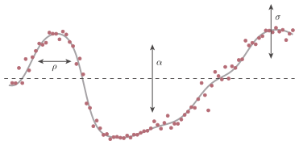
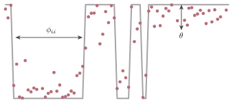
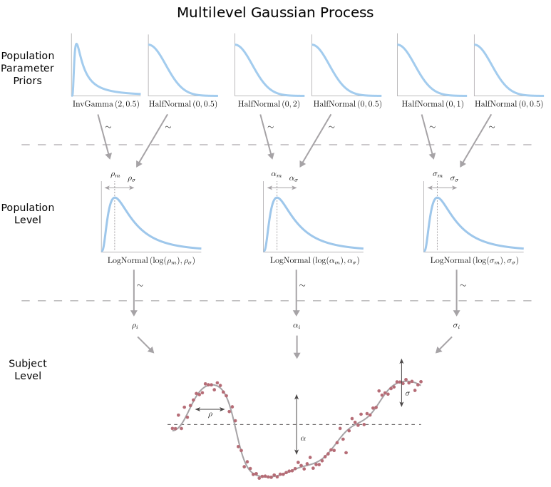

## Background

Lots of work in perceptual decision making has led to the hypothesis that perceptual decisions (such as deciding which way an object is moving, or whether an animal is predator or prey) are made by brain networks accumulating evidence for each option until some decision threshold is passed.  These evidence acumulation theories assume that brain activity starts at some baseline, and then integrates the incoming evidence for each choice.  When a "decision threshold" is passed, the option corresponding to that threshold is choosen.  Lots of work has shown that models built in this way (called [drift-diffusion models](https://en.wikipedia.org/wiki/Two-alternative_forced_choice#Computational_models_of_decision_making)) explain perceptual decisions very well.

For example, the image below shows simulations of such an integration process.  Each line is a different trial or decision.


However, there are other types of decisions besides purely perceptual ones.  Value-based decisions are higher-level decisions between actions which may result in outcomes that have different values to the chooser (like choosing what product to buy, which stock to invest in, or where to go for lunch).  These decisions are different from perceptual decisions because the evidence for one option over the other usually isn't coming directly from the senses.  With value-based decisions the chooser is using internal information as evidence: memories, background knowledge, and previously-learned values.

Some people have suggested that despite the difference in where the evidence is coming from, value-based decisions might also be made in the brain using this accumulation-to-threshold algorithm.  However, others have hypothesized that instead the brain may simply sample the options serially, and choose one after enough sampling.  This makes sense intuitively - if you're deciding between two products to buy, it seems like you consider one option, then the other, and then maybe consider the first option again, etc, until you've decided which option to take.  The accumulation-to-threshold algorithm implies that both options are considered simultaneously!

To determine if a brain area is sampling from options or more slowly accumulating evidence, we can record neural activity from that area, and decode the probability that the brain area is representing one option over the other as a subject is making a decision between those two options.  If that probability starts somewhere in the middle and slowly moves to favor one option, then it is more likely that the brain area is acting as an evidence accumulator and not sampling.  On the other hand, if the decoded probability flickers back and forth between options, it is more likely that the brain area is sampling.

Of course, we can't just take a look at the decoded probability traces and decide which one it "looks like!"  To quantify how sampling-like or accumulation-like the neural dynamics are, we will fit two different models to the neural activity and see which one best matches the neural activity.  As an evidence-accumulation-like model, we'll use a [Gaussian process](https://en.wikipedia.org/wiki/Gaussian_process), which assumes the dependent variable is changing slowly over time.  For a sampling-like model, we'll use a [hidden Markov model](https://en.wikipedia.org/wiki/Hidden_Markov_model), which assumes the dependent variable depends on the current "hidden state", which can change instantaneously between timesteps.


## Setup 

Let's set up our computing environment:

```{r}
setwd("~/Code/hmm-vs-gp")

# Packages
library(rstan)
library(ggplot2)
library(bayesplot)
library(invgamma)
library(bridgesampling)
library(RColorBrewer)
rstan_options(auto_write = TRUE)
options(mc.cores = parallel::detectCores())
seed = 1234567

# Colors
c_light <- c("#DCBCBC")
c_mid <- c("#B97C7C")
c_dark <- c("#8F2727")
c_blue_light <- c("#b2c4df")
c_blue_mid <- c("#6689bf")
c_blue_dark <- c("#3d5272")
color_scheme_set("red")
```


## Gaussian Processes

The first model we'll be fitting is a Gaussian process.  These models rely on the assumption that the dependent variable (y) at a given independent variable value (in our case, time) will be more similar to the y-value at timepoints nearby.  They also assume that the distribution of y values is a Gaussian distribution.  We can use a Gaussian process to model how the probability of an option, as decoded from neural activity, changes over time.


### Vanilla Gaussian Process

The most confusing part about Gaussian processes (in my opinion) is that instead of thinking of your data as $N$ datapoints which have $y$ values in 1-dimensional space, you instead need to think of having a *single* datapoint which has a $y$ value in $N$-dimensional space.  To visualize this, let's suppose we have just 2 datapoints - the first with a $y$ value of $1$, and the second with a $y$ value of $1.5$:

```{r, dev='svg'}
point_one = data.frame(x=c(1), y=c(1))
point_two = data.frame(x=c(2), y=c(1.5))
ggplot() +
  geom_point(data=point_one, aes(x=x, y=y), color=c_blue_mid, size=5) +
  geom_point(data=point_two, aes(x=x, y=y), color=c_mid, size=5) +
  xlim(0, 3) + ylim(0, 2) +
  ggtitle('Two Datapoints with 1D y-values')
```


We can think of the $y$ values of these two datapoints as being a single point in 2-dimensional space, where the value in the first dimension is $1$, and the value in the second dimension is $1.5$:

```{r, dev='svg'}
one_point = data.frame(x=c(1), y=c(1.5))
ggplot(one_point) +
  geom_vline(xintercept=1, color=c_blue_light, size=1) +
  geom_hline(yintercept=1.5, color=c_light, size=1) +
  geom_point(aes(x=x, y=y), color='black', size=5) +
  xlim(0, 2) + ylim(0, 2) +
  xlab('y value of first datapoint') +
  ylab('y value of second datapoint') +
  ggtitle('One Datapoint with 2D y-value')
```

Gaussian processes constrain points with similar $x$ values to have similar $y$ values by modeling them as being a single $N$-dimensional datapoint drawn from a Gaussian (normal) distribution with a given covarance structure.  This "covariance structure" is defined by a covariance matrix $\Sigma$, which depends on the $x$ values.  So, we can think of our $y$ values as being drawn from a multivariate normal distribution with covariance matrix $\Sigma$ (and also some mean $\mu$, but here we'll always use 0 for the mean).

$$
\mathbf{y} \sim \mathcal{N}(\mu=0, \Sigma)
$$

And remember, the $\mathbf{y}$ in the above equation is a *single* point in $N$-dimensional space representing the $y$ values of all our datapoints, not point(s) in 1-dimensional space.

If the distance between the $x$ values of two points is low, then the Gaussian distribution has a high covariance between those two dimensions, and the two points' $y$ values are also likely to be similar:

```{r, dev='svg'}
sigma = matrix(c(1,0.8,0.8,1), nrow=2)
data.grid = expand.grid(x=seq(-3, 3, length.out=200), y=seq(-3, 3, length.out=200))
q.samp = cbind(data.grid, prob=mvtnorm::dmvnorm(data.grid, sigma=sigma))
ggplot() + 
  geom_contour(data=q.samp, aes(x=x, y=y, z=prob), size=1, binwidth=0.08, color='black') +
  geom_vline(xintercept=1, color=c_blue_light, size=1) +
  geom_hline(yintercept=1.5, color=c_light, size=1) +
  geom_point(data=one_point, aes(x=x, y=y), color='black', size=5) +
  xlab('y value of first datapoint') +
  ylab('y value of second datapoint') +
  ggtitle('Joint probability distribution with high covariance')
```

If we take a vertical slice through this distribution (vertical line above), we can see that, given the value of the first datapoint, the probability of the value of the 2nd datapoint is pulled toward the value of the first datapoint.

```{r, dev='svg'}
x = cbind(rep(1, 300), seq(-2.5, 2.5, l=300))
p = mvtnorm::dmvnorm(x, sigma=sigma)
ggplot(data.frame(x=x, p=p)) + 
  geom_line(aes(x=x[,2], y=p), size=1, color=c_mid) +
  geom_vline(xintercept=1.5, color=c_light, size=1) +
  geom_vline(xintercept=1, color=c_blue_light, size=1) +
  annotate("text", label="1st datapoint", x=0.9, y=0.02, angle=90) +
  annotate("text", label="2nd datapoint", x=1.4, y=0.02, angle=90) +
  xlab('y value of second datapoint') +
  ylab('Probability') +
  ggtitle('Probability of 2nd datapoint given 1st')
```

And if we take a horizontal slice through this distribution (horizontal line in the joint distribution plot above), we can see that, given the value of the second datapoint, the probability of the value of the first datapoint is pulled toward the value of the second datapoint.

```{r, dev='svg'}
x = cbind(seq(-2.5, 2.5, l=300), rep(1.5, 300))
p = mvtnorm::dmvnorm(x, sigma=sigma)
ggplot(data.frame(x=x, p=p)) + 
  geom_line(aes(x=x[,1], y=p), size=1, color=c_blue_mid) +
  geom_vline(xintercept=1.5, color=c_light, size=1) +
  geom_vline(xintercept=1, color=c_blue_light, size=1) +
  annotate("text", label="1st datapoint", x=0.9, y=0.02, angle=90) +
  annotate("text", label="2nd datapoint", x=1.4, y=0.02, angle=90) +
  xlab('y value of first datapoint') +
  ylab('Probability') +
  ggtitle('Probability of 1st datapoint given 2nd')
```

On the other hand, if the $x$ values of two datapoints are distant, then a Gaussian process forces there to be a low covariance between the two dimensions (we'll see how below), and the value of one datapoint won't depend very much on the value of the other.  That is, the marginal probability of one datapoint given the value of the other will just be a normal distribution centered at 0, and won't be affected by the value of the other datapoint.

```{r, dev='svg'}
m = c(0, 0)
sigma = matrix(c(1,0,0,1), nrow=2)
data.grid = expand.grid(x=seq(-3, 3, length.out=200), y=seq(-3, 3, length.out=200))
q.samp = cbind(data.grid, prob=mvtnorm::dmvnorm(data.grid, mean=m, sigma=sigma))
ggplot() + 
  geom_contour(data=q.samp, aes(x=x, y=y, z=prob), size=1, binwidth=0.04, color='black') +
  geom_point(data=one_point, aes(x=x, y=y), color='black', size=5) +
  xlab('y value of first datapoint') +
  ylab('y value of second datapoint') +
  ggtitle('Joint probability distribution with low covariance')
```

The covariance structure of the Gaussian distribution we've been talking about is defined by a covariance matrix $\Sigma$.  The covariance matrix is just a square matrix, where the value at row $i$ and column $j$ is computed using a covariance function given the $x$ values of the $i$-th and $j$-th datapoints.

$$
\Sigma_{i,j} = K(x_i,x_j)
$$

This covariance function (or "kernel") is just a function that takes the $x$ values of two points, and returns a single value.  With basic covariance functions, this value is large if the two $x$ values are close together, and small when they're far apart (although there are other types of covariance functions which don't).  we'll use the "squared exponential" kernel (aka the Gaussian kernel or the radial basis function kernel).  For two data points which have $x$ values $x_i$ and $x_j$, the squared exponential kernel value between them is:

$$
K(x_i,x_j) = \alpha^2 \exp \left( - \frac{(x_i-x_j)^2}{2\rho^2} \right) + \sigma^2 \delta_{ij}
$$

This is just a Gaussian function where the distance between the two $x$ values is the dependent variable.

```{r, dev='svg'}
cov_exp_quad <- function(x) exp(-x^2/2)
plot(cov_exp_quad, -4, 4, n=300, xlab=expression(x[i] - x[j]), 
     ylab=expression(K( x[i], x[j] )),
     main="Squared Exponential Kernel",
     yaxt='n', bty='n', lwd=3, col=c_blue_mid)
```

The $\alpha$ and $\rho$ parameters in the kernel function are two hyperparameters of the Gaussian process. 

$\alpha^2$ is the signal variance (or "output" variance), because it controls how distant $y$ values are likely to fall from 0 by scaling the value of all elements of the covariance matrix.  A small $\alpha$ value will yield a Gaussian process which hovers close to 0 (assuming you're using 0 as your mean function, as we are).  A larger $\alpha$ value will yield a Gaussian process which can take values further from 0.

$\rho$ is the length-scale parameter, because it controls how quickly the $y$ values can change over time.  Smaller values of $\rho$ yield Gaussian processes whose $y$ values change quickly over time, while larger values of $\rho$ yield Gaussian processes with $y$ values which change more slowly with time.

Finally, the $\sigma^2$ term of the kernel function is the noise standard deviation - because we're assuming there is some noise associated with our observations.  $\delta_{ij}$ takes the value $1$ when $i$ and $j$ are the same, and 0 otherwise - so we're just adding $\sigma^2$ to the diagonal of $\Sigma$.

In short, we've got a model with three parameters: $\rho$ controls how quickly the latent function can change over time, $\alpha$ controls how far the latent function can stray from 0, and $\sigma$ controls how far the observed datapoints can stray from the latent function.




### Bounded Gaussian Process

So far we've assumed that the dependent variable can take *any* value!  This isn't the case when we're looking at the probability of a brain area representing an option - the probability value must be between 0 and 1.

To account for this, we can pass our probability values (our $y$ values) through the [logit function](https://en.wikipedia.org/wiki/Logit), which transforms values between 0 and 1 to values between $-\infty$ and $\infty$.  This "logit" function is the inverse of the sigmoidal (logistic) function.

$$
\text{logit}(x) = \log \left( \frac{x}{1-x} \right)
$$

Then, we can perform our Gaussian process regression on the transformed data.  However, we can't just transform the input values without transforming the probability density appropriately!  Because we've logit-transformed our values to be between 0 and 1, our Gaussian process is now modeling points as being drawn from a multivariate [logit-normal distribution](https://en.wikipedia.org/wiki/Logit-normal_distribution), instead of a normal multivariate normal distribution. (specifically a logit-normal distribution in the case of sigmoidal elements, not simplex elements).

A multivariate logistic normal distribution is defined between 0 and 1 in each of $N$ dimensions,

$$
\{ \mathbf{x} \in \mathbb{R}^N ~ | ~ \forall x_i, ~ 0 < x_i < 1 \}
$$

which is the space our data is in!  That is, we have $N$ datapoints (which we treat as a single datapoint in $N$-dimensional space), each of which falls between 0 and 1.  The probability density function for the multivariate logistic normal distribution is

$$
\mathcal{N}_{\text{logit}}(\mathbf{x};\mathbf{\mu},\mathbf{\Sigma}) = 
  \frac{1}{\prod_{i=1}^D x_i (1-x_i)} 
  \frac{1}{\sqrt{|2 \pi \Sigma |}}
  \exp \left( 
    -\frac{1}{2} 
    \left( \text{logit}(\mathbf{x})-\mathbf{\mu} \right)^\top
    \mathbf{\Sigma}^{-1}
    \left( \text{logit}(\mathbf{x})-\mathbf{\mu} \right)
  \right)
$$

Which is a lot of math - but it's just equivalent to the value of a (regular) multivariate normal distribution given logit-transformed $x$, times a scaling factor which ensures the density integrates to 1.

$$
\mathcal{N}_{\text{logit}}(\mathbf{x};\mathbf{\mu},\mathbf{\Sigma}) = 
  \frac{1}{\prod_{i=1}^D x_i (1-x_i)} 
  \mathcal{N}(\text{logit}(\mathbf{x});\mathbf{\mu},\mathbf{\Sigma})
$$

Without this scaling factor, we would be logit-transforming the $x$ values without appropriately scaling the probability density to compensate, and the probability density wouldn't integrate to 1!

For more information on Gaussian processes in general, Carl Rasmussen and Christopher Williams have written a [great textbook](http://www.gaussianprocess.org/gpml/) on Gaussian processes which is free.

### Priors

This is a Bayesian analysis, and so we'll be putting reasonable priors on our variables of interest.  The priors represent our expectation of what values the parameters can reasonably take, *prior* to seeing the data.  That is - how likely we think it is that a parameter can take a given value.  For a Gaussian process, it's important to have priors on our parameters, especially the length-scale parameter.  Without it, the best-fit length scale parameter can explode to huge values or shrink to tiny values, because our data does not contain any information about shorter timescales than occur between our datapoints, or larger timescales than the duration of our data.  Check out this [great case study](https://betanalpha.github.io/assets/case_studies/gp_part3/part3.html) by Michael Betancourt for more about why that happens.

For the length scale parameter ($\rho$) we use an inverse gamma prior with $\alpha=2$ and $\beta=0.5$.

$$
\frac{1}{\rho} \sim \text{Gamma}(\alpha=2, \beta=0.5)
$$

This results in a distribution which is defined $>0$, and has a low density near zero and at higher values.  This prior beleif about the value of $\rho$ will be incorporated into our Bayesian estimate of the value when we use Bayes rule to compute the posterior probability.

```{r, dev='svg'}
rho_prior <- function(x) dinvgamma(x, 2, 1/2)
plot(rho_prior, 0, 3, n=300, xlab='Rho', ylab='',
     main="Length scale parameter prior",
     yaxt='n', bty='n', lwd=3, col=c_blue_mid)
```

For the signal standard deviation parameter ($\alpha$, aka "marginal" standard deviation or "ouput" standard deviation) we use a half-normal prior (a normal distribution but with zero density $<0$) with $\sigma=2$.

$$
\alpha \sim \mathcal{N}(\mu=0, \sigma=2), ~ \alpha \geq 0
$$

This results in a distribution which only has density $\geq 0$, and has a low density at higher values.

```{r, dev='svg'}
alpha_prior <- function(x) ifelse(x>=0, 2*dnorm(x, 0, 2), 0)
plot(alpha_prior, 0, 6, n=300, xlab='Alpha', ylab='',
     main="Signal standard deviation parameter prior",
      yaxt='n', bty='n', lwd=3, col=c_blue_mid)
```

For the noise standard deviation parameter ($\sigma$) we also use a half-normal prior, but with $\sigma=1$.

$$
\sigma \sim \mathcal{N}(\mu=0, \sigma=1), ~ \alpha \geq 0
$$

This also results in a distribution which only has density $\geq 0$, and has a low density at higher values.

```{r, dev='svg'}
sigma_prior <- function(x) ifelse(x>=0, 2*dnorm(x, 0, 1), 0)
plot(sigma_prior, 0, 6, n=300, xlab='Sigma', ylab='',
     main="Noise standard deviation parameter prior",
      yaxt='n', bty='n', lwd=3, col=c_blue_mid)
```


### Generating Data from a Gaussian Process

We'll be using [Stan](http://mc-stan.org/) to generate and fit Bayesian models of Gaussian processes and, later, hidden Markov models.  Stan is a Bayesian modeling package which allows us to use the Stan language to describe a model, and then fit the model to data from R (Stan also has interfaces to Python, Matlab, etc).

A Stan program consists of several blocks.  The first block describes what input data the model can expect, and the second block contains how to transform to that data before using it to fit or generate data.  The "parameters" block contain a list of free parameters of the model, and the "model" block contains how to compute the posterior probability of the model given parameter values and the data.  For now, we're just generating data (and not fitting the model to data) so we'll leave those blocks empty.  Finally, the "generated quantities" block computes output data.

```{r}
writeLines(readLines("simulate_lgp.stan"))
```

We can generate data from a Gaussian process using this Stan model.  Let's generate 100 samples in the range 0 to 5.

```{r}
# Data
N = 100
x = seq(0, 5, l=N)
```

We'll also set the hyperparameters of the gaussian process.

```{r}
# Parameters
rho = 0.5
alpha = 2
sigma = 0.3
```

Now we can run the Stan model, which will generate data from a Gaussian process with these parameters.

```{r}
# Simulate
sim_params = list(N=N, x=x, rho=rho, alpha=alpha, sigma=sigma)
sim_gp = stan(file='simulate_lgp.stan', data=sim_params, iter=1, 
              chains=1, seed=seed, algorithm="Fixed_param")

# Extract simulated output
f = extract(sim_gp)$f[1,]
y = extract(sim_gp)$y[1,]
sim_data = data.frame(x=x, y=y, f=f)
```

Let's plot our generated Gaussian process:

```{r, dev='svg'}
# Plot generated data
ggplot(sim_data) +
  geom_line(aes(x=x, y=f), size=1) +
  geom_point(aes(x=x, y=y), color=c_mid) +
  ggtitle('Simulated Gaussian Process')
```

The line above is the latent function which was generated, and the dots are the generated observations.  Notice how the latent function varies smoothly over time, and varies between 0 and 1.  The observations have more jitter than the latent function (because they are generated from that function but with added noise), but each point is in the neigborhood of the previous point, and they are also bounded between 0 and 1.

### Fitting a Gaussian Process

Now that we've generated some data from a Gaussian process, we can attempt to fit a Gaussian process model to that data.  We'll use a separate Stan model, one which fits the parameters of the model to the data, instead of generating data from the parameters.  That means this time our data block will only contain the data (and not the desired parameter values, because we're fitting those), the parameter block will contain the free parameters of the model, and the model block will compute the posterior probability of the model given parameter values and the data.  In Stan, "target" is a variable which stores the log posterior probability, so we'll keep adding to it values which contribute to the posterior.

```{r}
writeLines(readLines("lgp.stan"))
```

(Side note: it's not necessary to perform the Cholesky decomposition in order to fit the model here - you can just draw `y` from a multivariate normal distribution with covariance matrix `K`.  The fit will actually run faster that way.  However I've done the Cholesky decomposition because it can be used to find the predictive mean and variance, as is done in [kridging](https://en.wikipedia.org/wiki/Kriging).  We're not actually doing that here, because we're primarily interested in model comparison, but for most applications you'd want the predictive mean and variance.  Also, for only 100 datapoints this method doesn't take all that much longer anyway, even with the decomposition.)

Let's fit the model to our generated data.

```{r}
# Fit
stan_rdump(c("N", "x", "y"), file="simulated_lgp.data.R")
gp_data = read_rdump("simulated_lgp.data.R")
fit_gp = stan(file='lgp.stan', data=gp_data, seed=seed)
```

After MCMC sampling has finished, we can view the posterior intervals for each parameter.

```{r}
# Show results of fit
print(fit_gp)
```

Before checking that our fits recover the true parameters which were used to generate the data, we'll run a few diagnostics to ensure that the MCMC sampling went smoothly and that our model isn't misspecified.  

First, we'll check that the MCMC chains converged.  The `Rhat` value in the table above should be close to 1.  The posterior distributions should also look the same across chains.

```{r, dev='svg', fig.height=3, fig.width=8}
# Plot density per chain
posterior = as.array(fit_gp)
mcmc_dens_overlay(posterior, pars=c("rho", "alpha", "sigma"))
```

The distributions look similar between chains, which is good!  This should also be apparent in the trace plot (the plot of posterior sample values vs sample number), and there shouldn't be any obvious "sliding" over time.

```{r, dev='svg', fig.height=3, fig.width=8}
# Plot trace per chain
mcmc_trace(posterior, pars=c("rho", "alpha", "sigma"))
```

Again, everything looks good here.

We should also check that none of the iterations hit the max tree depth.

```{r}
# Check no chains hit max tree depth
check_treedepth(fit_gp)
```

Another diagnostic to check is the energy Bayesian fraction of missing information (E-BFMI).

```{r}
# Check the energy Bayesian Fraction of Missing Information
check_energy(fit_gp)
```

Finally, we should check that iterations did not end with a divergence, indicating areas of parameter space that the sampling was not able to explore well.

```{r}
# Check for divergences
check_divergences(fit_gp)
```

All our diagnostics seem to indicate that we were able to fit the data without any sampling issues!  Now we can see how the posterior distributions for the parameters match up to the true parameters we used to generate the data.  First let's define a function which will plot our posterior distributions from the MCMC samples and their 95% confidence intervals.

```{r}
# Function to plot posterior distributions w/ 95% confidence intervals
interval_density = function(x, bot=0.025, top=0.975,
                            main="", xlab="", ylab="",
                            xlim=c(min(x),max(x)), lwd=1,
                            col1=c("#DCBCBC"), col2=c("#B97C7C")) {
  dens = density(x[x>xlim[1] & x<xlim[2]])
  plot(dens, main=main, xlab=xlab, ylab=ylab, xlim=xlim,
       lwd=lwd, yaxt='n', bty='n', type='n')
  polygon(dens, col=col1, border=NA)
  qbot <- quantile(x, bot)
  qtop <- quantile(x, top)
  x1 = min(which(dens$x >= qbot))
  x2 = max(which(dens$x < qtop))
  with(dens, polygon(x=x[c(x1,x1:x2,x2)], y=c(0, y[x1:x2], 0), col=col2, border=NA))
}
```

And now we can view the posteriors as compared to the true parameter values which were used to generate the data.

```{r, dev='svg', fig.height=3, fig.width=8}
# Plot true vs posterior
posterior = extract(fit_gp)
par(mfrow=c(1, 3))

interval_density(posterior$rho, xlab="rho")
abline(v=rho, col=c_dark, lwd=3)

interval_density(posterior$alpha, xlab="alpha")
abline(v=alpha, col=c_dark, lwd=3)

interval_density(posterior$sigma, xlab="sigma")
abline(v=sigma, col=c_dark, lwd=3)
```

The true parameter values are all within the bulk of the posterior, meaning we were able to successfully recover the true parameters!


## Hidden Markov Models

The other model we'll be fitting is a hidden Markov model.  In contrast to the Gaussian process, which assumed the $y$ value was changing slowly over time, hidden Markov models assume that the process generating the data is switching - instantaneously - between states.  The states are "hidden", in that we don't know for sure what state the system is in at any given time, but each state has a unique observation pattern associated with it.  In our case, we're concerned with the decoded probability flickering back and forth between near-0 and near-1, as would be expected if the brain area we're decoding from is sampling options.  So, our hidden Markov model will have 2 states, and the chance of observing a $y$ value near $0$ will be high in one state, and low in the other. 


### The Math

Our hidden Markov model will have two hidden states ($N=2$).  This means that our model has two free parameters which control the transition probabilities $\phi$.  The probability of transitioning from state $i$ to state $j$ is $\phi_{i,j}$.  In our Stan model, we'll fit the "recurrent" transition probabilities - that is, the probability that the hidden state at the current timestep will be the same as the last timestep.  We don't have to fit the non-recurrent transition probabilities because they form a simplex with the recurrent transition probabilities (that is, with only two states, the non-recurrent transition probabilities *have* to be $1$ minus the recurrent transition probabilities, and vice-versa, since the sum of the two must sum to $1$).  So, the two free parameters which control the transition probabilities are:

$$
\phi_{i,i} ~ \text{for} ~ i \in \{1,2\}
$$

We model the probability of observing a certain value for $y$, given the current hidden state, as a beta distribution.  I'll refer to this as the "observation model", because it's the part of the model which controls how the hidden states relate to the outcomes ($y$ values) we observe.  However, for each hidden state, one parameter of the distribution is fixed at $1$, and the other parameter is free.  This gives us two additional parameters ($\theta_1$ and $\theta_2$) which control the observation probabilities corresponding to the hidden states.  So for the first state $x_1$,

$$
y|x_1 \sim \text{Beta}(1, \theta_1)
$$

and for the second state $x_2$,

$$
y|x_2 \sim \text{Beta}(\theta_2, 1)
$$

(Side note: we don't *have* to use a beta distribution for our observation model, we just need a distribution bounded between 0 and 1, which is greater towards one extreme than the other.  We could also have used a 1-dimensional logit-normal distribution, and constrained $\mu$ to be $>0$ for one state and $<0$ for the other state.  I decided to use a beta distribution just because it's simpler - there's only 1 free parameter here per hidden state, whereas a logit-normal distribution would have two.)

The reason the beta distribution has flipped parameters for one state (that is, $\alpha=1,\beta=\theta_1$ for one state and $\alpha=\theta_2,\beta=1$ for the other) is so the first state will always correspond to $y$ values which are closer to 0, and the second state will always correspond to $y$ values which are closer to 1.  If we allow both parameters of the beta distribution to be free for both states, our resulting posterior distributions will be bimodal.  This is because the first state could correspond to low $y$ values, and the second to high $y$ values, or vice versa - both would be equally likely!

Setting one parameter of the beta distribution to $1$ also ensures that the resulting beta distributions are monotonic - that is, the probability value is always greater towards the corresponding state's extreme (either 0 or 1).  Plotted below are these beta distributions with different values of $\theta$.  The blue lines correspond to the first state, and the red lines to the second state.  Darker shades indicate larger values of $\theta$.

```{r, dev='svg'}
x = seq(0, 1, l=300)
df = data.frame(x = x,
                s11 = dbeta(x, 1, 1.2),
                s12 = dbeta(x, 1, 3),
                s13 = dbeta(x, 1, 5),
                s21 = dbeta(x, 1.2, 1),
                s22 = dbeta(x, 3, 1),
                s23 = dbeta(x, 5, 1))
ggplot(df) + 
  geom_line(aes(x=x, y=s11), color=c_blue_light, size=1) +
  geom_line(aes(x=x, y=s12), color=c_blue_mid, size=1) +
  geom_line(aes(x=x, y=s13), color=c_blue_dark, size=1) +
  geom_line(aes(x=x, y=s21), color=c_light, size=1) +
  geom_line(aes(x=x, y=s22), color=c_mid, size=1) +
  geom_line(aes(x=x, y=s23), color=c_dark, size=1) + 
  xlab('y value') +
  ylab('Observation Probability') +
  ggtitle('Observation Probabilities for each state, given different parameters')

```

Finally, to compute the probability of the model over all possible sequences of hidden states (marginalize over the hidden states), we will use the [forward algorithm](https://en.wikipedia.org/wiki/Forward_algorithm).  A hidden Markov model assumes that the state at a given timepoint only affects the probability of the hidden state at the *next* timepoint (and not states at further timepoints).  Therefore, we can compute the probability of being in the current state, given *any* previous sequence of hidden states, in a recursive manner.  Suppose we've computed the probability of being in state $1$ at timepoint $t$ given any previous sequence of hidden states (the "marginal probability", let's call it $\gamma(t,1)$), and the same for state $2$ ($gamma(t,2)$).  Then, we can compute the probability of being in state $i$ at time $t+1$ with just the previous marginal probabilities ($gamma(t,1)$ and $gamma(t,2)$), the transition probabilities ($\phi$), and the observation probabilities ($p(y|x_j)$, which we defined earlier in terms of beta distributions).

$$
\gamma(t,i) = p(y_t | x_t) \sum_{j \in \{1, 2\}} \phi_{j,i} ~ \gamma(t-1,j)
$$

The sum above is over possible states $j$ (so only $1$ and $2$ in our case).  This equation is just computing the probability of arriving at state $i$ from any other state, times the probability of our observation given that we're in that hidden state.

So, we have a model with two states ("up" and "down") where the $\phi$ parameter for each state controls how long the model is likely to stay in the same state, and the $\theta$ parameter for that state controls how far the observed values are allowed to stray from that state's extrema.



### Priors

For the observation model parameters ($\theta$) we use a gamma prior with $\alpha,\beta=2$, and limit the values to be $\geq 1$,

$$
\theta_i - 1 \sim \text{Gamma}(\alpha=2, \beta=2)
$$

This results in a distribution which has zero density $<1$, and low density at higher values.

```{r, dev='svg'}
theta_prior <- function(x) dgamma(x-1, 2, 1/2)
plot(theta_prior, 0, 10, n=300, xlab='Theta', ylab='',
     main="Observation model parameter prior",
      yaxt='n', bty='n', lwd=3, col=c_blue_mid)
```

(Side note: the notation above and the Stan programs below use the $\text{Gamma}(\alpha,\beta)$ parameterization of the gamma distribution, while the R function `dgamma` uses the $\text{Gamma}(\kappa,\theta)$ parameterization, where $\kappa=\alpha$ and $\theta=1/\beta$, in case you were wondering why the parameters in the call to `dgamma` were $2,1/2$ instead of $2,2$)

For the recurrent transition probability prior, we use a beta distribution with $\alpha,\beta=1.2$,

$$
\phi_{i,i} \sim \text{Beta}(1.2, 1.2)
$$

This results in a "toast-shaped" distribution which is bounded between $0$ and $1$, and has lower density towards more extreme values.

```{r, dev='svg'}
trans_prior <- function(x) dbeta(x, 1.2, 1.2)
plot(trans_prior, 0, 1, n=300, xlab='Phi_{i,i}', ylab='',
     main="Recurrent transition probability prior",
     type='l', yaxt='n', bty='n', lwd=3, col=c_blue_mid)
```


### Generating Data from a Hidden Markov Model

Now we'll build a Stan routine to generate data from a hidden Markov model with certain parameters.  In the generated quantities block, we'll simulate the hidden Markov model and generate our data.  We'll start in a random hidden state, and transition to a different state (or the same state) at each time step randomly according to the transition probabilities. At each timestep, we'll generate a $y$ value from the observation parameters of that state.

```{r}
writeLines(readLines("simulate_hmm.stan"))
```

We can use this Stan model to generate data from our hidden Markov model.  Let's generate 100 samples.

```{r}
# Data
N = 100
```

We will also set the parameters of the HMM.

```{r}
# Parameters
phi = array(c(0.9, 0.1, 0.1, 0.9), dim=c(2,2)) #transition probabilities
theta = c(5, 5) #observation distribution parameters
```

Now we can run the Stan model, which will generate data from a hidden Markov model with these parameters.

```{r}
# Simulate
sim_params = list(N=N, phi=phi, theta=theta)
sim_hmm = stan(file='simulate_hmm.stan', data=sim_params, iter=1, 
               chains=1, seed=seed, algorithm="Fixed_param")

# Extract simulated output
s = t(extract(sim_hmm)$s)-1
y = t(extract(sim_hmm)$y)
sim_data = data.frame(x=seq(N), s=s, y=y)
```

Let's plot the data generated by our hidden Markov model:

```{r, dev='svg'}
# Plot generated data
ggplot(sim_data) +
  geom_line(aes(x=x, y=s), size=1) +
  geom_point(aes(x=x, y=y), color=c_mid) +
  ggtitle('Simulated Hidden Markov Model')
```

In contrast to the Gaussian process, data generated by the hidden Markov model does *not* vary smoothly over time, but instead jumps back and forth between extremes.  Because of the way we defined the observation part of the model, observations during the first hidden state are close to 0, and observations during the second hidden state are close to 1.  However, all observations are between 0 and 1, and there is again some noise to the observations.


### Fitting a Hidden Markov Model

Now that we've generated some data from a Gaussian process, we can attempt to fit a Gaussian process model to that data.  We'll use a separate Stan model, one which fits the parameters of the model to the data, instead of generating data from the parameters.

```{r}
writeLines(readLines("hmm.stan"))
```

Let's fit the model to our generated data.

```{r}
# Fit
y = y[,1]
stan_rdump(c("N", "y"), file="simulated_hmm.data.R")
hmm_data = read_rdump("simulated_hmm.data.R")
fit_hmm = stan(file='hmm.stan', data=hmm_data, seed=seed)
```

After MCMC sampling has finished, we can view the posterior intervals for each parameter.

```{r}
# Show results of fit
print(fit_hmm)
```

Again we'll check several diagnoistics to ensure our sampling effectively explored the parameter space.  The Rhat values look good, and if we look at the posterior distributions per chain, it appears the chains converged.


```{r, dev='svg'}
# Plot density per chain
posterior = as.array(fit_hmm)
mcmc_dens_overlay(posterior, 
                  pars=c("phi[1,1]", "phi[2,2]", "theta[1]", "theta[2]"))
```

The trace plots also indicate that the chains (likely) explored similar areas of parameter space, and that the warmup period was (probably) long enough.

```{r, dev='svg'}
# Plot trace per chain
mcmc_trace(posterior, 
           pars=c("phi[1,1]", "phi[2,2]", "theta[1]", "theta[2]"))
```

Our other three diagnostics also look good:

```{r}
# Check other diagnostics
check_hmc_diagnostics(fit_hmm)
```

Now we can see how the posterior distributions for the parameters match up to the true parameters we used to generate the data.  We'll also plot the prior distributions for each parameter so we can see how that effects the posterior.  The prior distribution is plotted in blue, the posterior distribution in red, and the parameter value used to generate the data as a dark red vertical line.

```{r, dev='svg'}
# Plot true vs posterior
posterior = extract(fit_hmm)
par(mfrow=c(2, 2))

beta_prior <- function(x) dbeta(x, 1.2, 1.2)
gamma_prior <- function(x) dgamma(x, 2, 1/2)

interval_density(posterior$phi[,1,1], xlab="phi[,1,1]", xlim=c(0,1))
plot(beta_prior, 0, 1, add=TRUE, col=c_blue_light, lwd=3)
abline(v=phi[1,1], col=c_dark, lwd=3)

interval_density(posterior$phi[,2,2], xlab="phi[,2,2]", xlim=c(0,1))
plot(beta_prior, 0, 1, add=TRUE, col=c_blue_light, lwd=3)
abline(v=phi[2,2], col=c_dark, lwd=3)

interval_density(posterior$theta[,1], xlab="theta[1]", xlim=c(0,12))
plot(gamma_prior, 0, 12, add=TRUE, col=c_blue_light, lwd=3)
abline(v=theta[1], col=c_dark, lwd=3)

interval_density(posterior$theta[,2], xlab="theta[2]", xlim=c(0,12))
plot(gamma_prior, 0, 12, add=TRUE, col=c_blue_light, lwd=3)
abline(v=theta[2], col=c_dark, lwd=3)
```

We were mostly able to recover the parameters which generated the data - but not perfectly!  This is because we set parameter values which didn't align very well with the priors - with more data the posteriors would be pulled even closer to the true vaules.  Notice how the posteriors for the first state's parameters ($\phi_{1,1}$ and $\theta_1$) are closer to the true value than the posteriors for the second state's parameters.  This is because in our generated data, more observations occurred during the first state.  Therefore, the fit was able to better infer the true parameters corresponding to that state.  Our posteriors were indeed pulled towards the true parameter values, which is what we want to see, and indicates our Bayesian fit of the hidden Markov model was successful - we'd just ideally have more data!


## Model Comparison using Bridge Sampling 

What we're really interested in is not just fitting the models to data, but comparing the models to see which one is more likely to explain our data.  We'll use a Bayes factor to compare the plausibility of our models, given the data.  A Bayes factor is the ratio of the marginal probabilities for our two models ($\mathcal{M}_1$ and $\mathcal{M}_2$).

$$
\text{Bayes factor}~(\mathcal{M}_1, \mathcal{M}_2) = \frac{p(y ~ | ~ \mathcal{M}_1)}{p(y ~ | ~ \mathcal{M}_2)}
$$

Bayes factors greater than 1 indicate that model $\mathcal{M}_1$ is more likely to explain the data.  The marginal likelihood of each model ($p(y ~ | ~ \mathcal{M})$) is the sum of the posterior probability of the model across *all possible combinations* of parameter choices:

$$
p(y~|~\mathcal{M}) = \int p(y~|~\theta, \mathcal{M}) ~ p(\theta ~ | ~ \mathcal{M}) d\theta
$$

where $\theta$ is a set of parameter values, $p(y~|~\theta, \mathcal{M})$ is the likelihood of the model given that set of parameter values, and $p(\theta ~ | ~ \mathcal{M})$ is the prior probability of that choice of parameter values.

Unfortunately, that integral is difficult to evaluate, because it's an integral in a space with dimensionality equal to the number of parameters in the model!  Our models may have only three to four parameters, but keep in mind that if we want to apply these models to real experimental data, we'll want to use multilevel models, where each subject gets their own set of parameters, and then there will be additional hyperparameters which constrain individuals' parameter values.  So, if we only have four parameters, with just 25 subjects, we'll suddenly end up with upwards of a hundred parameters!  And evaluating an integral in one-hundred-dimensional space is... hard.  Or at least extremely computationally expensive.

Instead of directly evaluating the above integral to compute the marginal probability, we'll estimate the value using a technique called "bridge sampling."  


### Bridge Sampling

Bridge sampling is a method for estimating the marginal likelihood when you have MCMC samples from the posterior distribution (which we get when we fit the models with Stan!).  I won't get into the math of bridge sampling, but there's a great [tutorial on bridge sampling](https://arxiv.org/abs/1703.05984) if you're interested.  There is also a [bridgesampling package](https://cran.r-project.org/web/packages/bridgesampling/index.html) for R which we'll be using to compute the Bayes factors between our models.


### Comparing GP and HMM models with Bridge Sampling

Let's use bridge sampling to compare the marginal likelihoods of each model given the data that we generated using a Gaussian process.  If everything is working correctly, the Bayes factor should favor the Gaussian process model over the hidden Markov model (because we used the Gaussian process to generate the data in the first place!).

First we have to fit the hidden Markov model to the data generated by a Gaussian process (we've already fit the GP model to the GP-generated data, so we won't re-do that here).

```{r}
# Fit HMM to GP-generated data
gp_data = read_rdump("simulated_lgp.data.R")
fit_hmm_to_gp = stan(file='hmm.stan', data=gp_data, seed=seed)
```

We are able to fit the hidden Markov model to the data generated by the Gaussian process without problems.

```{r}
# Check MCMC diagnostics
check_hmc_diagnostics(fit_hmm_to_gp)
```

The resulting fit looks reasonable.

```{r}
print(fit_hmm_to_gp)
```

```{r, dev='svg'}
# Plot true vs posterior
posterior = extract(fit_hmm_to_gp)
par(mfrow=c(2, 2))
interval_density(posterior$phi[,1,1], xlab="phi[,1,1]")
interval_density(posterior$phi[,2,2], xlab="phi[,2,2]")
interval_density(posterior$theta[,1], xlab="theta[1]")
interval_density(posterior$theta[,2], xlab="theta[2]")
```

However, with data generated by the Gaussian process, the Bayes factor favors the Gaussian process over the hidden Markov model!

```{r}
# Perform bridge sampling and view Bayes factor for GP-generated data
bridge_gp_gp = bridge_sampler(fit_gp)
bridge_hmm_gp = bridge_sampler(fit_hmm_to_gp)
lbf1 = bf(bridge_gp_gp, bridge_hmm_gp, log=TRUE)
cat(sprintf("Log Bayes factor in favor of GP over HMM on GP-generated data: %0.3g\n", lbf1$bf))
```

We can also see the error of the two marginal probability estimates.  

```{r}
cat(sprintf("Error percentage for GP fit to GP-generated data: %s\n", error_measures(bridge_gp_gp)$percentage))
cat(sprintf("Error percentage for HMM fit to GP-generated data: %s\n", error_measures(bridge_hmm_gp)$percentage))
```

These error measures will help us determine how confident we can be that the estimated Bayes factor reflects which model truly has a larger marginal probability.  In this case, the difference between the two estimated log marginal probabilities (the Bayes factor) is large, and the error on those estimates is small, and so we can be confident that the Gaussian process is indeed fitting the data better than the hidden Markov model.  Which, of course, it should - because the data was generated by a Gaussian process!

Similarly, we want to ensure that the Bayes factor favors the hidden Markov model over the Gaussian process when fitting to the data generated by the hidden Markov model.

```{r}
# Fit GP to HMM-generated data
hmm_data = read_rdump("simulated_hmm.data.R")
hmm_data$x = gp_data$x
fit_gp_to_hmm = stan(file='lgp.stan', data=hmm_data, seed=seed)
```

We are able to fit the Gaussian process model to the data generated by the hidden Markov model without problems.

```{r}
# Check MCMC diagnostics
check_treedepth(fit_gp_to_hmm)
check_energy(fit_gp_to_hmm)
check_divergences(fit_gp_to_hmm)
```

And the resulting fit looks reasonable.

```{r}
print(fit_gp_to_hmm)
```

```{r, dev='svg', fig.height=3, fig.width=8}
# Plot true vs posterior
posterior = extract(fit_gp_to_hmm)
par(mfrow=c(1, 3))
interval_density(posterior$rho, xlab="rho", xlim=c(0, 0.4))
interval_density(posterior$alpha, xlab="alpha")
interval_density(posterior$sigma, xlab="sigma")
```

However, with data generated by the hidden Markov model, the Bayes factor favors the hidden Markov model over the Gaussian process!

```{r}
# Perform bridge sampling and view Bayes factor for HMM-generated data
bridge_hmm_hmm = bridge_sampler(fit_hmm)
bridge_gp_hmm = bridge_sampler(fit_gp_to_hmm)
lbf2 = bf(bridge_hmm_hmm, bridge_gp_hmm, log=TRUE)
cat(sprintf("Log Bayes factor in favor of HMM over GP on HMM-generated data: %0.3g\n", lbf2$bf))
```

Again we'll check the error of the marginal probability estimates.

```{r}
cat(sprintf("Error percentage for GP fit to HMM-generated data: %s\n", error_measures(bridge_gp_hmm)$percentage))
cat(sprintf("Error percentage for HMM fit to HMM-generated data: %s\n", error_measures(bridge_hmm_hmm)$percentage))
```

The difference between the two marginal probability estimates isn't as huge this time, though the error of the estimates is still pretty small.  Just in case, let's check the lower bound of the Bayes factor estimate.

```{r}
bf_lb = (bridge_hmm_hmm$logml - 
         0.01*as.numeric(sub("%", "", error_measures(bridge_hmm_hmm)$percentage))) -
        (bridge_gp_hmm$logml +
         0.01*as.numeric(sub("%", "", error_measures(bridge_gp_hmm)$percentage)))
cat(sprintf("Lower bound of Bayes factor estimate in favor of HMM over GP on HMM-generated data: %0.3g\n", bf_lb))
```

Finally, the log marginal likelihood of the Gaussian process was greater when fit to data generated by a Gaussian process than when fit to data generated by a hidden Markov model.

```{r}
cat(sprintf("Log marginal likelihood of GP fit to GP-generated data: %0.3g\n", bridge_gp_gp$logml))
cat(sprintf("Log marginal likelihood of GP fit to HMM-generated data: %0.3g\n", bridge_gp_hmm$logml))
```

And the log marginal likelihood of the hidden Markov model was greater when fit to data generated by a HMM than when fit to data generated by a Gaussian process.

```{r}
cat(sprintf("Log marginal likelihood of HMM fit to HMM-generated data: %0.3g\n", bridge_hmm_hmm$logml))
cat(sprintf("Log marginal likelihood of HMM fit to GP-generated data: %0.3g\n", bridge_hmm_gp$logml))
```


## Repeated Measures

The Stan models we've created so far are only able to handle a single time series.  But we have multiple time series: one for each pass through the choice point.  That is, one per trial.  To handle multiple trials, we have to create modified Stan models which accumulate the contribution of each trial by summing the log likelihoods of each trial.  Here's Stan code for a Gaussian process which can handle multiple trials:

```{r}
writeLines(readLines("lgp_multitrial.stan"))
```

And Stan code for a hidden Markov model which can handle multiple trials:

```{r}
writeLines(readLines("hmm_multitrial.stan"))
```

These are relatively minor changes to the Stan routines - basically we've simply accumulated the log posterior across trials.  The rest of this section is simply validating that these Stan models work correctly.

Let's generate some data from a Gaussian process which contiains multiple time series (as if we collected data over multiple trials).

```{r}
# Data
N = 100
Nt = 10 #number of trials
x = seq(0, 5, l=N)

# Parameters
rho = 0.5
alpha = 2
sigma = 0.3

# Arrays to store generated data
f = matrix(data=NA, nrow=Nt, ncol=N)
y = matrix(data=NA, nrow=Nt, ncol=N)
xs = matrix(x, nrow=Nt, ncol=N, byrow=TRUE)

# Simulate
sim_params = list(N=N, x=x, rho=rho, alpha=alpha, sigma=sigma)
for (trial in 1:Nt){
  sim_gp = stan(file='simulate_lgp.stan', data=sim_params, iter=1, 
                chains=1, seed=trial*100, algorithm="Fixed_param")
  f[trial,] = extract(sim_gp)$f
  y[trial,] = extract(sim_gp)$y
}

# Store data
gp_data = list(N=N, Nt=Nt, x=x, y=y)
```

And now we can take a look at all the latent functions we generated (lines) and the corresponding observations (points).

```{r, dev='svg'}
# Set the palette to something as ungarish as possible...
palette(brewer.pal(n=10, name="Paired"))

# Plot the data
matplot(t(xs), t(f), type='l', lty=1, lwd=2, 
        ylim=c(0, 1), xlab='', ylab='')
par(new=T)
matplot(t(xs), t(y), type='p', pch=20, 
        ylim=c(0, 1), xlab='x', ylab='f')
title('Multiple draws from a Gaussian process')
```

Similarly, we'll generate multiple time series from a hidden Markov model.

```{r}
# Data
N = 100
Nt = 10 #number of trials

# Parameters
phi = array(c(0.9, 0.1, 0.1, 0.9), dim=c(2,2)) #transition probabilities
theta = c(5, 5) #observation distribution parameters

# Arrays to store generated data
s = matrix(data=NA, nrow=Nt, ncol=N)
y = matrix(data=NA, nrow=Nt, ncol=N)
xs = matrix(x, nrow=Nt, ncol=N, byrow=TRUE)

# Simulate
sim_params = list(N=N, phi=phi, theta=theta)
for (trial in 1:Nt){
  sim_hmm = stan(file='simulate_hmm.stan', data=sim_params, iter=1, 
                 chains=1, seed=trial*100, algorithm="Fixed_param")
  s[trial,] = extract(sim_hmm)$s-1
  y[trial,] = extract(sim_hmm)$y
}

# Store data
hmm_data = list(N=N, Nt=Nt, x=x, y=y)
```

And here's the data generated by the hidden Markov model.  (Note that the y values below aren't accurate, the traces are staggered so we can see each trace)

```{r, dev='svg'}
# Plot the data
matplot(t(xs), t(s+0:9), type='l', lty=1, lwd=2, 
        ylim=c(0, 10), xlab='', ylab='')
par(new=T)
matplot(t(xs), t(y+0:9), type='p', pch=20, 
        ylim=c(0, 10), xlab='x', ylab='f')
title('Multiple draws from a hidden Markov model')
```

Now we can fit both models to both sets of data.

```{r}
# Fit each model to each multitrial dataset
fit_gp_to_gp = stan(file='lgp_multitrial.stan', data=gp_data, seed=seed)
fit_hmm_to_gp = stan(file='hmm_multitrial.stan', data=gp_data, seed=seed)
fit_gp_to_hmm = stan(file='lgp_multitrial.stan', data=hmm_data, seed=seed)
fit_hmm_to_hmm = stan(file='hmm_multitrial.stan', data=hmm_data, seed=seed)
```

Let's check the MCMC diagnostics to ensure there weren't any major problems with the fits.

```{r}
# Check MCMC diagnostics for GP fit to GP data
check_hmc_diagnostics(fit_gp_to_gp)

# Check MCMC diagnostics for HMM fit to GP data
check_hmc_diagnostics(fit_hmm_to_gp)

# Check MCMC diagnostics for GP fit to HMM data
check_hmc_diagnostics(fit_gp_to_hmm)

# Check MCMC diagnostics for HMM fit to HMM data
check_hmc_diagnostics(fit_hmm_to_hmm)
```

The chains converged for all four fits (Rhat values look good - i.e. they are near 1).

```{r}
# Check GP fit to GP data
print(fit_gp_to_gp)

# Check HMM fit to GP data
print(fit_hmm_to_gp)

# Check GP fit to HMM data
print(fit_gp_to_hmm)

# Check HMM fit to HMM data
print(fit_hmm_to_hmm)
```

Were the models able to recover the parameters used to generate the data?  The Gaussian process fit was able to sucessfully recover the parameters of the Gaussian process used to generate the data.  The vertical red line shows the true parameter value, and the distribution is the posterior.

```{r, dev='svg', fig.height=3, fig.width=8}
# Plot true vs posterior for GP
posterior = extract(fit_gp_to_gp)
par(mfrow=c(1, 3))

interval_density(posterior$rho, xlab="rho")
abline(v=rho, col=c_dark, lwd=3)

interval_density(posterior$alpha, xlab="alpha")
abline(v=alpha, col=c_dark, lwd=3)

interval_density(posterior$sigma, xlab="sigma")
abline(v=sigma, col=c_dark, lwd=3)
```

Similarly, the hidden Markov model fit was able to sucessfully recover the parameters of the hidden Markov model used to generate the data.

```{r, dev='svg'}
# Plot true vs posterior
posterior = extract(fit_hmm_to_hmm)
par(mfrow=c(2, 2))

interval_density(posterior$phi[,1,1], xlab="phi[,1,1]")
abline(v=phi[1,1], col=c_dark, lwd=3)

interval_density(posterior$phi[,2,2], xlab="phi[,2,2]")
abline(v=phi[2,2], col=c_dark, lwd=3)

interval_density(posterior$theta[,1], xlab="theta[1]")
abline(v=theta[1], col=c_dark, lwd=3)

interval_density(posterior$theta[,2], xlab="theta[2]")
abline(v=theta[2], col=c_dark, lwd=3)
```

Do the fits of one model to data generated by the other model at least look reasonable?  The Gaussian process fit to the data generated by the hidden Markov model looks reasonable.

```{r, dev='svg', fig.height=3, fig.width=8}
# Plot true vs posterior
posterior = extract(fit_gp_to_hmm)
par(mfrow=c(1, 3))
interval_density(posterior$rho, xlab="rho", xlim=c(0, 0.4))
interval_density(posterior$alpha, xlab="alpha")
interval_density(posterior$sigma, xlab="sigma")
```

As does the hidden Markov model fit to the data generated by the Gaussian process.

```{r, dev='svg'}
# Plot true vs posterior
posterior = extract(fit_hmm_to_gp)
par(mfrow=c(2, 2))
interval_density(posterior$phi[,1,1], xlab="phi[,1,1]")
interval_density(posterior$phi[,2,2], xlab="phi[,2,2]")
interval_density(posterior$theta[,1], xlab="theta[1]")
interval_density(posterior$theta[,2], xlab="theta[2]")
```

The Bayes factor should favor a fit of the model which generated the data over a fit of the other model.  Let's use bridge sampling to estimate the marginal probabilities of each of the four fits so that we can estimate the Bayes factors.

```{r}
# Perform bridge sampling for each model
bridge_gp_gp = bridge_sampler(fit_gp_to_gp)
bridge_hmm_gp = bridge_sampler(fit_hmm_to_gp)
bridge_gp_hmm = bridge_sampler(fit_gp_to_hmm)
bridge_hmm_hmm = bridge_sampler(fit_hmm_to_hmm)
```

The bridge-sampling-estimated Bayes factor favored the Gaussian process fit to data generated by the Gaussian process.

```{r}
lbf1 = bf(bridge_gp_gp, bridge_hmm_gp, log=TRUE)
cat(sprintf("Log Bayes factor in favor of GP over HMM on GP-generated data: %0.3g\n", lbf1$bf))
```

Conversely, the bridge-sampling-estimated Bayes factor favored the hidden Markov model fit to data generated by the hidden Markov model.

```{r}
lbf2 = bf(bridge_hmm_hmm, bridge_gp_hmm, log=TRUE)
cat(sprintf("Log Bayes factor in favor of HMM over GP on HMM-generated data: %0.3g\n", lbf2$bf))
```

Finally, the log marginal likelihood of the Gaussian process was greater when fit to data generated by a Gaussian process than when fit to data generated by a hidden Markov model.

```{r}
cat(sprintf("Log marginal likelihood of GP fit to GP-generated data: %0.3g\n", bridge_gp_gp$logml))
cat(sprintf("Log marginal likelihood of GP fit to HMM-generated data: %0.3g\n", bridge_gp_hmm$logml))
```

And the log marginal likelihood of the hidden Markov model was greater when fit to data generated by a HMM than when fit to data generated by a Gaussian process.

```{r}
cat(sprintf("Log marginal likelihood of HMM fit to HMM-generated data: %0.3g\n", bridge_hmm_hmm$logml))
cat(sprintf("Log marginal likelihood of HMM fit to GP-generated data: %0.3g\n", bridge_hmm_gp$logml))
```

TODO: Hm. Uh. Or not...


## Multilevel Models

Another problem with the Stan models so far is they only handle a single subject.  We want our models to include mixed effects (that is, account for inter-subject variability).  So, we'll build multilevel versions of both the Gaussian process and hidden Markov models which can handle multiple trials from multiple subjects.  This "multilevel" model will have a subject level and a population level.  At the subject level, each subject has their own set of parameters, which are used to compute the probability of the data for that subject.  But, each subect's parameters aren't completely independent: at the population level, each subject's paramters are drawn from a population distribution. 


### Gaussian Process

Our basic single-level Gaussian process has three parameters: the length scale ($\rho$), the signal standard deviation ($\alpha$, a.k.a. the marginal or output standard deviation), and the noise standard deviation ($\sigma$).  All three parameters are constrained to be greater than zero.  We'll use a [log-normal distribution](https://en.wikipedia.org/wiki/Log-normal_distribution) to model the population distribution for all three parameters.  A log normal distribution is just a normal distribution, but where the variable has been passed through the $\log$ function.  This causes the distribution to be defined only $>0$. Furthermore, we'll put a prior on the medians of these population-level distributions which is the same as the priors we were previously using on the parameters themselves (in the single-subject versions of the models).

Here's a diagram of the multilevel Gaussian process model, and below we'll walk through it step by step.



The length scale parameter ($\rho$) for each subject $i$ is drawn from a population log-normal distribution with median $\rho_m$ and standard deviation parameter $\rho_\sigma$.

$$
\forall i, ~ \rho_i \sim \text{LogNormal}(\log (\rho_m), ~ \rho_\sigma)
$$

I say "standard deviation parameter" instead of "standard deviation", because the second parameter of the log-normal distribution is not the standard deviation of the distribution - it's the standard deviation of the *logarithm* of the distribution.

The prior on the median of this population distribution is an inverse gamma distribution with $\alpha=2$ and $\beta=0.5$ (which was the prior on the $\rho$ parameter in the single-subject models).

$$
\rho_m \sim \text{InvGamma}(2, 0.5)
$$

The prior on the standard deviation parameter ($\rho_\sigma$) is a half-normal distribution with a standard deviation of $0.5$.

$$
\rho_\sigma \sim \text{HalfNormal}(0, 0.5)
$$

The signal standard deviation parameter ($\alpha$) for each subject $i$ is drawn from a population log-normal distribution with median $\alpha_m$ and standard deviation parameter $\alpha_\sigma$..

$$
\forall i, ~ \alpha_i \sim \text{LogNormal}(\log (\alpha_m), ~ \alpha_\sigma)
$$

The prior on the median of this population distribution is a half-normal distribution with $\mu=0$ and $\sigma=2$ (which was the prior on the $\alpha$ parameter in the single-subject models).

$$
\alpha_m \sim \text{HalfNormal}(0, 2)
$$

The prior on the standard deviation parameter ($\alpha_\sigma$) is also a half-normal distribution, but with a standard deviation of $0.5$.

$$
\alpha_\sigma \sim \text{HalfNormal}(0, 0.5)
$$

Finally, the noise standard deviation parameter ($\sigma$) for each subject $i$ is drawn from a population log-normal distribution with median $\sigma_m$ and standard deviation parameter $\sigma_sigma$.

$$
\forall i, ~ \sigma_i \sim \text{LogNormal}(\log (\sigma_m), \sigma_\sigma)
$$

The prior on the median of this population distribution is a half-normal distribution with a standard deviation of $1$ (which was the prior on the $\alpha$ parameter in the single-subject models).

$$
\sigma_m \sim \text{HalfNormal}(0, 1)
$$

And the prior on the standard deviation parameter ($\sigma_\sigma$) is a half-normal distribution with a standard deviation of $0.5$.


### Hidden Markov Model

The single-subject hidden Markov model has four parameters: the recurrent transition probabilities for state 1 ($\phi_{1,1}$) and state 2 ($\phi_{2,2}$), along with the observation parameters for state 1 ($\theta_1$) and state 2 ($\theta_2$).  The transition probabilities ($\phi_{i,i}$) are constrained between 0 and 1, so we'll use a [logit-normal distribution](https://en.wikipedia.org/wiki/Logit-normal_distribution) to model their population distribution, which keeps the density between 0 and 1.  This is similar to what we did in order to bound the Gaussian process between 0 and 1.  On the other hand, the observation parameters ($\theta_i$) are constrained to be greater than zero (with no upper bound), so we'll use a log-normal distribution to model their population distribution (as we did with the population distributions for the multilevel Gaussian process).  

Like with the multilevel Gaussian process, we'll put a prior on the medians of the population distributions which are identical to the priors we used on the raw parameters in the single-subject versions of the models.  Why the medians instead of the means?  Just for simplicity and consistency, really.  Because of the skew introduced by the log- and logit-transforms, the means of the log- and logit-normal distributions are not equal to their $\mu$ parameters.  The mean of a log-normal distribution is relatively easy to compute ($exp(\mu+\frac{\sigma^2}{2})), but the mean of a logit-normal distribution has no analytical solution, and would have to be estimated numerically.  Which would be a pain to do manually in Stan, would be *hideously* inelegant, and as of version 2.17.0, Stan doesn't have a built-in function for doing this.  So, I decided to just put the prior on the median (instead of the mean) for all population-level distributions.

Here's a diagram of the multilevel hidden Markov model, and below we'll walk through it step by step.


The transition probability parameters ($\phi_{i,i}$) for each subject $s$ are drawn from population logit-normal distributions with medians $\phi_{i,m}$ and standard deviation parameters $\phi_{i,\sigma}$.

$$
\forall s, ~ \phi_{i,i,s} \sim \text{LogitNormal}(\text{logit}^{-1}(\phi_{i,m}), ~ \phi_{i,\sigma})
$$

Where $\phi_{i,i,s}$ is the $\phi_{i,i}$ parameter for subject $s$ and state $i$, $\phi_{i,m}$ is the median of the population distribution for the recurrent transition probability parameters of state $i$, and $\phi_{i,\sigma}$ is the standard deviation parameter for that population distribution.

The prior on the medians of these population distributions are beta distributions with $\alpha=1.2$ and $\beta=1.2$ (which was the prior on the $\phi_{i,i}$ parameters in the single-subject models).

$$
\forall i \in \{1,2\}, ~ \phi_{i,m} \sim \text{Beta}(1.2, 1.2)
$$

And the prior on the standard deviation parameters are half-normal distributions with standard deviations of 1.

$$
\forall i \in \{1,2\}, ~ \phi_{i,\sigma} \sim \text{HalfNormal}(0, 1)
$$

The observation parameters ($\theta_i$) for each subject $s$ are drawn from population log-normal distributions with medians $\theta_{i,m}$ and standard deviation parameters $\theta_{i,\sigma}$.  

$$
\forall s, ~ \theta_{i,s} \sim \text{LogNormal}(\log(\theta_{i,m}), ~ \theta_{i,\sigma})
$$

Where $\theta_{i,s}$ is the $\theta_i$ parameter for subject $s$ and state $i$, $\theta_{i,m}$ is the median of the population distribution for the observation distribution parameter for state $i$, and $\theta_{i,\sigma}$ is the standard deviation parameter for that population distribution.

The prior on the medians of these population distributions are gamma distributions with $\alpha=2$ and $\beta=2$ (which was the prior on the $\theta_i$ parameters in the single-subject models).

$$
\forall i \in \{1, 2\}, ~ \theta_{i,m} \sim \text{Gamma}(2,2)
$$

And the prior on the standard deviation parameters are half-normal distributions with standard deviations of 2.

$$
\forall i \in \{1, 2\}, ~ \theta_{i,\sigma} \sim \text{HalfNormal}(0,2)
$$


### Non-centered parameterizations

In theory, the models above are good as is.  However, in practice, the models are difficult to sample from because of the geometry of the posterior distribution.  With a hierarchical model, individuals' parameters are drawn from a population distribution.  When the variance of the population distribution is large, the individuals' parameters are able to approach their non-pooled values (the value which that individual's parameter would have if we fit the model to only data from that individual).  However, the variance of the population distribution can shrink (up to a point) while maintaining a similar posterior probability, because while the likelihood of any one individual's data decreases, the likelihood due to individuals' parameters being drawn from the population distribution increases (because the distribution is being compressed).  This can lead to a "funnel"-like geometry in the posterior.


Stan and other MCMC-based samplers use a sampling method which takes discrete steps (check out this [great interactive animation by Chi Feng](https://chi-feng.github.io/mcmc-demo/app.html#EfficientNUTS,banana) showing how different MCMC samplers sample from the posterior).  So, at the "neck" of the "funnel," the posterior is extremely thin, and the sampler can quickly step out of a region of high posterior density.  When it does so, the large gradient outside the funnel can cause the sampling transitions to "diverge" (shoot out towards infinity).  Most of the transitions in the neck of the funnel will end in this kind of divergence when the funnel is sharp enough, and so the resulting MCMC samples won't accurately reflect the true posterior because they didn't sample in the neck of the funnel!  This will cause our parameter estimates to be incorrect, as they will be biased away from the region of parameter-space corresponding to the neck of the funnel.  If we try to fit the models as is, nearly *half* of the transitions end up diverging!

To correct for this problem, we can use a non-centered parameterization of our models.  Instead of defining an individual $i$'s parameter (say, $\theta_i$) as being drawn from a population distribution, we will instead draw a per-subject scaling factor $\tilde{\theta}_i$ from a normal distribution (which is independent from the population distribution variance).

$$
\tilde{\theta}_i \sim \text{Normal}(0, 1)
$$

Then we can set each individual's parameter by multiplying the population distribution standard deviation ($\theta_\sigma$) by the scaling factor, and adding the population distribution's location parameter ($\theta_m$).

$$
\theta_i = \theta_m + \tilde{\theta}_i ~ \theta_\sigma
$$

This is mathematically equivalent to our previous model, but transforms the posterior distribution's geometry into a much simpler form.  Now, parameter-space only includes the value for $\tilde{\theta}$ and not for $\theta$ itself, which is now a transformed parameter.  This means the posterior is no longer funnel-shaped, and divergent transitions become much less of a problem.  For more about this problem and how to fix it, check out this great [case study by Michael Betancourt](http://mc-stan.org/users/documentation/case-studies/divergences_and_bias.html).  Or [read the paper about it](https://arxiv.org/abs/1312.0906).

Here's a diagram of the non-centered parameterization of the Gaussian process model.  Instead of drawing individuals' parameters from a population distribution, we now construct them from per-subject scaling factors which are drawn from a standard normal distribution.


Here is the Stan routine for the multilevel Gaussian process model, with a non-centered parameterization.  The main difference is that now we have to compute a covariance matrix for each subject individually, and now we have population distributions from which individual subject's parameters are drawn.

```{r}
writeLines(readLines("lgp_multilevel.stan"))
```

I tried implementing several optimizations, including pre-computing logit(y) (in the transformed data block), writing a custom user-defined Stan function to compute the covariance matrix which assumed linearly-spaced x values, etc.  However, none of the optimizations actually ended up making the sampling run any faster!  Stan's pretty fast as is.  Well.  Maybe not "fast".  *Optimized*.

We'll do the same thing for the hidden Markov model.  Here's a diagram of the non-centered parameterization of the hidden Markov model.


And here's the Stan routine for the multilevel hidden Markov model with a non-centered parameterization.

```{r}
writeLines(readLines("hmm_multilevel.stan"))
```


### Validation

Let's generate some data from a Gaussian process which contiains simulated data from multiple trials and multiple subjects.

```{r}
# Data
N = 50 #datapoints per trial
Ns = 5 #number of subjects
Nts = 5 #number of trials per subject
Nt = Ns*Nts #total number of trials
x = seq(0, 2.5, l=N)

# Population Distribution Means and variances
rho_mu = 0.5
rho_var = 0.025
alpha_mu = 2
alpha_var = 0.1
sigma_mu = 0.3
sigma_var = 0.01

# Compute gamma distribution parameters from mean + variance
rho_a = rho_mu*rho_mu/rho_var
rho_b = rho_mu/rho_var
alpha_a = alpha_mu*alpha_mu/alpha_var
alpha_b = alpha_mu/alpha_var
sigma_a = sigma_mu*sigma_mu/sigma_var
sigma_b = sigma_mu/sigma_var

# Arrays to store generated data
f = matrix(data=NA, nrow=Nt, ncol=N) #latent function
y = matrix(data=NA, nrow=Nt, ncol=N) #observation values
sid = matrix(data=NA, Nt)        #subject id
rho_true = matrix(data=NA, Ns)   #true rho value for each subject
alpha_true = matrix(data=NA, Ns) #true alpha value for each subject
sigma_true = matrix(data=NA, Ns) #true sigma value for each subject
xs = matrix(x, nrow=Nts, ncol=N, byrow=TRUE)

# Simulate
for (sub in 1:Ns){
  rho_true[sub] = rgamma(1, rho_a, rho_b) #rho for this subject
  alpha_true[sub] = rgamma(1, alpha_a, alpha_b) #alpha for this subj
  sigma_true[sub] = rgamma(1, sigma_a, sigma_b) #sigma for this subj
  sim_params = list(N=N, x=x, rho=rho_true[sub], 
                    alpha=alpha_true[sub], sigma=sigma_true[sub])
  for (trial in 1:Nts){
    ix = (sub-1)*Nts+trial #index in array of all trials
    sim_gp = stan(file='simulate_lgp.stan', data=sim_params, iter=1, 
                  chains=1, seed=ix, algorithm="Fixed_param")
    f[ix,] = extract(sim_gp)$f
    y[ix,] = extract(sim_gp)$y
    sid[ix,] = sub
  }
}

# Store data
gp_data = list(N=N, Nt=Nt, Ns=Ns, x=x, S=as.vector(sid), y=y)
```

And now we can take a look at all the latent functions we generated (lines) and the corresponding observations (points) for each subject (stacked vertically).

```{r, dev='svg'}
# Plot the data
plot.new()
par(mfrow=c(Ns,1))
for (sub in 1:Ns){
  ix = 1:Nts+(sub-1)*Nts #indexes of this subj in array of all trials
  par(mfg=c(sub,1), mar=c(1,4,1,1))
  matplot(t(xs), t(f[ix,]), type='l', lty=1, lwd=2, 
          ylim=c(0, 1), xlab='', ylab='')
  par(new=T)
  matplot(t(xs), t(y[ix,]), type='p', pch=20, 
          ylim=c(0, 1), xlab='x', ylab=paste('Sub ',toString(sub)))
}
```

Similarly, we'll generate multiple trials from multiple subjects using a hidden Markov model.

```{r}
# Population Distribution Means and variances
phi_mu = 0.9
phi_var = 0.043
theta_mu = 4
theta_var = 0.3

# Compute distribution parameters from mean + variance
phi_a = 18
phi_b = 2
theta_a = (theta_mu-1)*(theta_mu-1)/theta_var
theta_b = (theta_mu-1)/theta_var

# Arrays to store generated data
s = matrix(data=NA, nrow=Nt, ncol=N) #hidden state
y = matrix(data=NA, nrow=Nt, ncol=N) #observed values
sid = matrix(data=NA, Nt)          #subject id
phi_true = matrix(data=NA, Ns, 2)  #true phi values for each subject
theta_true = matrix(data=NA, Ns, 2)#true theta values for each subject

# Simulate
for (sub in 1:Ns){
  p1 = rbeta(1, phi_a, phi_b) #phi parameters for this subject
  p2 = rbeta(1, phi_a, phi_b)
  t1 = 1+rgamma(1, theta_a, theta_b) #thetas for this subj
  t2 = 1+rgamma(1, theta_a, theta_b)
  phi_true[sub,] = c(p1,p2)
  theta_true[sub,] = c(t1,t2)
  phi = t(array(c(p1, 1-p1, 1-p2, p2), dim=c(2,2)))
  theta = c(t1, t2)
  sim_params = list(N=N, phi=phi, theta=theta)
  for (trial in 1:Nts){
    ix = (sub-1)*Nts+trial #index in array of all trials
    sim_hmm = stan(file='simulate_hmm.stan', data=sim_params, iter=1, 
                   chains=1, seed=ix, algorithm="Fixed_param")
    s[ix,] = extract(sim_hmm)$s-1
    y[ix,] = extract(sim_hmm)$y
    sid[ix,] = sub
  }
}

# Store data
hmm_data = list(N=N, Nt=Nt, Ns=Ns, x=x, S=as.vector(sid), y=y)
```

And here's the data generated by the hidden Markov model.

```{r, dev='svg'}
# Plot the data
plot.new()
par(mfrow=c(Ns,1))
for (sub in 1:Ns){
  ix = 1:Nts+(sub-1)*Nts #indexes of this subj in array of all trials
  par(mfg=c(sub,1), mar=c(1,4,1,1))
  matplot(t(xs), t(s[ix,]), type='l', lty=1, lwd=2, 
          ylim=c(0, 1), xlab='', ylab='')
  par(new=T)
  matplot(t(xs), t(y[ix,]), type='p', pch=20, 
          ylim=c(0, 1), xlab='x', ylab=paste('Sub ',toString(sub)))
}
```

Now we can fit both models to both sets of data.

```{r}
# Fit each model to each multisubject dataset
fit_gp_to_gp = stan(file='lgp_multilevel.stan', data=gp_data, seed=seed)
fit_hmm_to_gp = stan(file='hmm_multilevel.stan', data=gp_data, seed=seed)
fit_gp_to_hmm = stan(file='lgp_multilevel.stan', data=hmm_data, seed=seed)
fit_hmm_to_hmm = stan(file='hmm_multilevel.stan', data=hmm_data, seed=seed)
```

The chains converged for all four fits (Rhat values look good are near 1), and the number of effective samples look OK for the parameters of interest, though we may want to run sampling for more iterations than the default (notice that the effective number of samples for the population mean parameters `phi_m` and `theta_m` are closer to 1000 than 4000).  Let's take a look at the HMC diagnostics.

```{r}
# Check MCMC diagnostics for GP fit to GP data
check_hmc_diagnostics(fit_gp_to_gp)

# Check MCMC diagnostics for HMM fit to GP data
check_hmc_diagnostics(fit_hmm_to_gp)

# Check MCMC diagnostics for GP fit to HMM data
check_hmc_diagnostics(fit_gp_to_hmm)

# Check MCMC diagnostics for HMM fit to HMM data
check_hmc_diagnostics(fit_hmm_to_hmm)
```

The diagnostics look mostly good, however there were a few divergent transitions.  However, an extremely small proportion of all the MCMC transitions were divergent (less than half a percent of samples).  Let's take a look at the fit with the most divergent transitions (the fit of the hidden Markov model to the data generated by itself). Below we've plotted the value of the standard deviation of the $\phi_{1,1}$ population distribution (on the y-axis) and the value of the first subject's $\phi_{1,1}$ parameter (on the x-axis). If divergent transitions were being caused by a misspecification of our hierarchical model, we would expect to see the divergent transitions concentrated at the "tip" of the hierarchical "funnel". Each dot is a MCMC sample, and bright red dots indicate samples which ended in a divergence.  

```{r, dev='svg'}
# Show pairs plot for phi param
mcmc_scatter(as.array(fit_hmm_to_hmm), 
             pars=c("phi[1,1,1]", "phi_s[1]"), 
             transform=list("phi_s[1]"="log"), 
             np=nuts_params(fit_hmm_to_hmm))
```

The divergent transitions don't seem to be concentrating in any particular region of parameter space, and so increasing our `adapt_delta` parameter will probably help decrease the number of divergent transitions, and we don't need to re-specify our model.  If we had fit the original version of the model (the centered parameterization), divergent transitions would have been concentrated at the tip of the funnel, and nearly half of the transitions would have ended in a divergence!

To be absolutely sure, we can check this for each subject.  In the pairs plots below, the hierarchical funnel can be seen in the bottom row, where the funnel shrinks going downward, and in the rightmost column, where the funnel shrinks going leftward.  Here, red x's mark divergent transitions.

```{r, dev='svg'}
# Show pairs plot for phi param
mcmc_pairs(as.array(fit_hmm_to_hmm), 
           pars=c("phi[1,1,1]", "phi[2,1,1]", "phi[3,1,1]", "phi[4,1,1]", "phi[5,1,1]", "phi_s[1]"), 
           transform=list("phi_s[1]"="log"), 
           np=nuts_params(fit_hmm_to_hmm))
```

And also for the $\phi$ parameter of the 2nd state:

```{r, dev='svg'}
# Show pairs plot for phi param
mcmc_pairs(as.array(fit_hmm_to_hmm), 
           pars=c("phi[1,2,2]", "phi[2,2,2]", "phi[3,2,2]", "phi[4,2,2]", "phi[5,2,2]", "phi_s[2]"), 
           transform=list("phi_s[2]"="log"), 
           np=nuts_params(fit_hmm_to_hmm))
```

And similarly for the $\theta$ parameter for the first state:

```{r, dev='svg'}
# Show pairs plot for theta param
mcmc_pairs(as.array(fit_hmm_to_hmm), 
           pars=c("theta[1,1]", "theta[2,1]", "theta[3,1]", "theta[4,1]", "theta[5,1]", "theta_s[1]"), 
           transform=list("theta_s[1]"="log"), 
           np=nuts_params(fit_hmm_to_hmm))
```

And the $\theta$ parameter for the second state:

```{r, dev='svg'}
# Show pairs plot for theta param
mcmc_pairs(as.array(fit_hmm_to_hmm), 
           pars=c("theta[1,2]", "theta[2,2]", "theta[3,2]", "theta[4,2]", "theta[5,2]", "theta_s[2]"), 
           transform=list("theta_s[2]"="log"), 
           np=nuts_params(fit_hmm_to_hmm))
```

Indeed the divergences don't seem to be clustering at the tip of the funnel for any parameter.

Were the models able to recover the parameters used to generate the data?  The Gaussian process fit was able to sucessfully recover the parameters of the Gaussian process used to generate the data.

```{r, dev='svg', fig.height=3, fig.width=8}
# Plot true vs posterior for GP fit to GP
posterior = extract(fit_gp_to_gp)
par(mfrow=c(1, 3))

interval_density(posterior$rho_m, 
                 xlab="Population median rho")
abline(v=median(rho_true), col=c_dark, lwd=3)

interval_density(posterior$alpha_m, 
                 xlab="Population median alpha")
abline(v=median(alpha_true), col=c_dark, lwd=3)

interval_density(posterior$sigma_m, 
                 xlab="Population median sigma")
abline(v=median(sigma_true), col=c_dark, lwd=3)
```

As was the hidden Markov model!

```{r, dev='svg'}
# Plot true vs posterior
posterior = extract(fit_hmm_to_hmm)
par(mfrow=c(2, 2))

interval_density(posterior$phi_m[,1], 
                 xlab="Population median phi[1,1]")
abline(v=median(phi_true[,1]), col=c_dark, lwd=3)

interval_density(posterior$phi_m[,2], 
                 xlab="Population median phi[2,2]")
abline(v=median(phi_true[,2]), col=c_dark, lwd=3)

interval_density(posterior$theta_m[,1], 
                 xlab="Population median theta[1]")
abline(v=median(theta_true[,1]), col=c_dark, lwd=3)

interval_density(posterior$theta_m[,2], 
                 xlab="Population median theta[2]")
abline(v=median(theta_true[,2]), col=c_dark, lwd=3)
```

We also want to ensure that the fit was able to recover the correct values for each individual's parameters.  The Gaussian process fit to data generated by itself was (for the most part) able to recover the correct parameter values for each individual:

```{r, dev='svg', fig.height=3, fig.width=8}
# Plot true vs posterior for GP fit to GP
posterior = extract(fit_gp_to_gp)
par(mfrow=c(Ns, 3), mar=c(1,1,1,1))

for (sub in 1:Ns){
  interval_density(posterior$rho[,sub], 
                   xlab=sprintf("rho_%d", sub))
  abline(v=rho_true[sub], col=c_dark, lwd=3)
  
  interval_density(posterior$alpha[,sub], 
                   xlab=sprintf("alpha_%d", sub))
  abline(v=alpha_true[sub], col=c_dark, lwd=3)
  
  interval_density(posterior$sigma[,sub], 
                   xlab=sprintf("sigma_%d", sub))
  abline(v=sigma_true[sub], col=c_dark, lwd=3)
}
```

As was the hidden Markov model.

```{r, dev='svg'}
# Plot true vs posterior
posterior = extract(fit_hmm_to_hmm)
par(mfrow=c(Ns, 4), mar=c(1,1,1,1))

for (sub in 1:Ns){
  interval_density(posterior$phi[,sub,1,1], 
                   xlab=sprintf("phi_1,1,%d", sub))
  abline(v=phi_true[sub,1], col=c_dark, lwd=3)
  
  interval_density(posterior$phi[,sub,2,2], 
                   xlab=sprintf("phi_2,2,%d", sub))
  abline(v=phi_true[sub,2], col=c_dark, lwd=3)
  
  interval_density(posterior$theta[,sub,1], 
                   xlab=sprintf("theta_1,%d", sub))
  abline(v=theta_true[sub,1], col=c_dark, lwd=3)
  
  interval_density(posterior$theta[,sub,1], 
                   xlab=sprintf("theta_2,%d", sub))
  abline(v=theta_true[sub,2], col=c_dark, lwd=3)
}
```

Again, the Bayes factor should favor a fit of the model which generated the data over a fit of the other model.  We'll again use bridge sampling to estimate the marginal probabilities of each of the four fits so that we can estimate the Bayes factors.

```{r}
# Perform bridge sampling for each model
bridge_gp_gp = bridge_sampler(fit_gp_to_gp)
bridge_hmm_gp = bridge_sampler(fit_hmm_to_gp)
bridge_gp_hmm = bridge_sampler(fit_gp_to_hmm)
bridge_hmm_hmm = bridge_sampler(fit_hmm_to_hmm)
```

The bridge-sampling-estimated Bayes factor favored the Gaussian process fit to data generated by the Gaussian process.

```{r}
lbf1 = bf(bridge_gp_gp, bridge_hmm_gp, log=TRUE)
cat(sprintf("Log Bayes factor in favor of GP over HMM on GP-generated data: %0.3g\n", lbf1$bf))
```

Conversely, the bridge-sampling-estimated Bayes factor favored the hidden Markov model fit to data generated by the hidden Markov model.

```{r}
lbf2 = bf(bridge_hmm_hmm, bridge_gp_hmm, log=TRUE)
cat(sprintf("Log Bayes factor in favor of HMM over GP on HMM-generated data: %0.3g\n", lbf2$bf))
```

Finally, the log marginal likelihood of the Gaussian process was greater when fit to data generated by a Gaussian process than when fit to data generated by a hidden Markov model.

```{r}
cat(sprintf("Log marginal likelihood of GP fit to GP-generated data: %0.3g\n", bridge_gp_gp$logml))
cat(sprintf("Log marginal likelihood of GP fit to HMM-generated data: %0.3g\n", bridge_gp_hmm$logml))
```

And the log marginal likelihood of the hidden Markov model was greater when fit to data generated by a HMM than when fit to data generated by a Gaussian process.

```{r}
cat(sprintf("Log marginal likelihood of HMM fit to HMM-generated data: %0.3g\n", bridge_hmm_hmm$logml))
cat(sprintf("Log marginal likelihood of HMM fit to GP-generated data: %0.3g\n", bridge_hmm_gp$logml))
```


## Conclusion

By fitting both the Gaussian process model and the hidden Markov model to neural data, we can use bride sampling to find which model is more likely to explain the neural activity.  However, it's important to realize that even if the Bayes factor favors one of these models over the other, that doesn't imply that model explains how the neural activity is being generated.  Rather, it just shows that the dynamics of the neural activity better match one model than the other.  The Bayes factor between the Gaussian process and the hidden Markov model will only tell us whether the neural representation of reward appears to be flicking back and forth between options (as would be predicted by sampling/deliberative theories of decision-making), or more slowly varying over time (as would be predicted by drift diffusion or integrate-to-threshold theories).  Ultimately, *how* the brain area of interest comes to represent reward in that way can only be understood by studying the inputs to that area, the connectivity within that area and its inputs, along with what information those inputs are representing and when.  Furthermore, it could very well be that one brain area is sampling, while another (perhaps downstream) brain area is performing integration, given the output value signals of the sampling.


## Original Computing Environment

```{r}
writeLines(readLines(file.path(Sys.getenv("HOME"), ".R/Makevars")))
```

```{r}
devtools::session_info()
```

